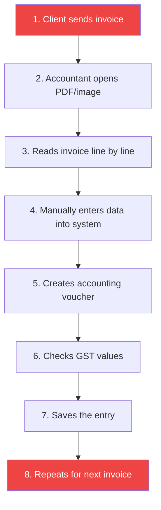

# Product Requirements Document

**Document Version:** 1.1  
**Last Updated:** August 2026  
**Status:** Approved for Phase 1 MVP

---

## 1. Product Identity

**Product Name:** CA AI

**Tagline:** Upload Once → AI Understands → Human Reviews → System Completes the Rest

**Alternative Names Considered:**

| Name | Notes |
|------|-------|
| CAOS | "CA Operating System" — potential confusion with "chaos" |
| LedgerAI | Clean, but generic |
| AI Accountant | Descriptive, but may imply full replacement |
| SmartBooks AI | Professional, overlaps with QuickBooks branding |

**Decision:** Use **CA AI** as the primary product name throughout all documentation and UI.

---

## 2. Vision

CA AI is designed to remove repetitive data entry work from accounting and Chartered Accountant firms. The software helps accountants spend less time typing and more time reviewing, validating, and advising.

The product is **not meant to replace accountants**. It is meant to increase operational capacity, reduce errors, and improve turnaround time.

---

## 3. Problem Statement

The current bookkeeping workflow in many Indian CA firms is highly manual:

**Consequences of the manual process:**

| Problem | Business Impact |
|---------|----------------|
| Slow processing | Delayed financial reporting |
| Repetitive effort | Employee burnout, low morale |
| Higher staffing needs | Increased operational cost |
| Avoidable human errors | Compliance risk, client dissatisfaction |
| Delayed reporting | Poor business decisions |
| Inconsistent data quality | Audit findings, rework |

---

## 4. Product Goal

**Phase 1 Goal:** Build a system that converts invoice documents into structured accounting data and Tally-ready voucher output.

### Input

| Source | Format | Notes |
|--------|--------|-------|
| PDF invoice | `.pdf` | Machine-readable or scanned |
| Scanned invoice | `.jpg`, `.png`, `.tiff` | From scanner or printer |
| Photographed invoice | `.jpg`, `.png`, `.heic` | From mobile camera |

### Output

| Output | Format | Purpose |
|--------|--------|---------|
| Extracted invoice fields | Structured JSON | Review and storage |
| Validation results | Pass/Fail with details | Data quality assurance |
| Suggested ledger classification | Ledger name + confidence | Accounting categorization |
| Voucher draft | Structured record | Accounting entry |
| Tally-compatible export | XML file | Import into Tally Prime |

---

## 5. Business Objective

Enable **one accountant** to handle the repetitive bookkeeping workload that previously required **three to five people**.

**Target Efficiency Gains:**

| Metric | Before CA AI | With CA AI |
|--------|-------------|------------|
| Invoices per accountant per day | 30–50 | 150–300 |
| Time per invoice | 5–10 minutes | 30–60 seconds (review only) |
| Error rate | 3–8% | < 1% (AI + validation) |
| Export time | Manual Tally entry | One-click XML import |

---

## 6. Target Users

### User Personas

#### Persona 1: Rajesh — Senior CA (Decision Maker)

| Attribute | Detail |
|-----------|--------|
| **Role** | Partner at a mid-size CA firm (15–30 staff) |
| **Age** | 42 |
| **Pain Points** | Staff spend 70% of time on data entry; hiring is expensive; errors cause compliance issues |
| **Goal** | Reduce operational headcount for bookkeeping by 50% |
| **Tech Comfort** | Uses Tally daily, comfortable with web apps, not a developer |

#### Persona 2: Priya — Junior Accountant (Primary Operator)

| Attribute | Detail |
|-----------|--------|
| **Role** | Staff accountant processing 40+ invoices daily |
| **Age** | 26 |
| **Pain Points** | Monotonous data entry, frequent overtime, eye strain from reading invoices |
| **Goal** | Process invoices faster, go home on time, reduce errors on her record |
| **Tech Comfort** | Comfortable with Tally and Excel, quick to learn new tools |

#### Persona 3: Amit — Firm IT Admin (Setup & Config)

| Attribute | Detail |
|-----------|--------|
| **Role** | IT manager responsible for tool adoption and configuration |
| **Age** | 34 |
| **Pain Points** | New tools are hard to integrate with existing Tally workflows; staff resist change |
| **Goal** | Smooth deployment, minimal training, seamless Tally integration |
| **Tech Comfort** | Can manage servers, configure software, basic scripting |

### Primary Users

- Chartered Accountant firms
- Accounting firms
- Bookkeeping companies

### Secondary Users

- SMEs with in-house accounting
- Transport companies (high invoice volume)
- Manufacturing companies
- Wholesalers and distributors
- Retailers

---

## 7. User Stories

### Authentication

| ID | User Story | Priority |
|----|-----------|----------|
| US-01 | As an accountant, I want to sign up with my email so that I can access the platform | Must |
| US-02 | As an accountant, I want to log in securely so that my data is protected | Must |
| US-03 | As an accountant, I want to reset my password so that I can recover my account | Must |
| US-04 | As an admin, I want to manage user roles so that I can control access levels | Should |

### Invoice Processing

| ID | User Story | Priority |
|----|-----------|----------|
| US-10 | As an accountant, I want to upload a PDF invoice so that the system can process it | Must |
| US-11 | As an accountant, I want to upload an image invoice so that scanned documents are supported | Must |
| US-12 | As an accountant, I want to drag-and-drop files so that uploading is fast | Should |
| US-13 | As an accountant, I want to preview the document before processing so that I confirm the right file | Should |
| US-14 | As an accountant, I want to upload multiple invoices at once so that batch processing is efficient | Could |

### OCR & AI Extraction

| ID | User Story | Priority |
|----|-----------|----------|
| US-20 | As an accountant, I want the system to extract text from scanned invoices so that I don't type manually | Must |
| US-21 | As an accountant, I want the AI to identify invoice fields (number, date, vendor, items, totals) so that data is structured automatically | Must |
| US-22 | As an accountant, I want to see confidence scores so that I know which fields to double-check | Should |
| US-23 | As an accountant, I want the system to remember vendor patterns so that repeat invoices are faster | Could |

### Validation

| ID | User Story | Priority |
|----|-----------|----------|
| US-30 | As an accountant, I want GSTIN format to be validated automatically so that I catch errors early | Must |
| US-31 | As an accountant, I want arithmetic (subtotal + tax = total) checked so that calculation errors are caught | Must |
| US-32 | As an accountant, I want duplicate invoice detection so that I don't enter the same invoice twice | Must |
| US-33 | As an accountant, I want date validity checks so that future or impossible dates are flagged | Should |

### Voucher & Export

| ID | User Story | Priority |
|----|-----------|----------|
| US-40 | As an accountant, I want the system to suggest the correct ledger for each line item so that I don't look it up manually | Must |
| US-41 | As an accountant, I want a voucher draft generated automatically so that I only review, not create | Must |
| US-42 | As an accountant, I want to review and edit extracted data before approval so that I maintain control | Must |
| US-43 | As an accountant, I want to export approved vouchers as Tally-compatible XML so that I can import directly | Must |
| US-44 | As an accountant, I want to see export history so that I can track what was sent to Tally | Should |

---

## 8. Phase 1 Scope

### In Scope (Must Have)

- ✅ User authentication (signup, login, password reset)
- ✅ Company and client management
- ✅ Invoice upload (PDF + images)
- ✅ OCR text extraction
- ✅ AI-based invoice data extraction
- ✅ GST and totals validation
- ✅ Duplicate invoice detection
- ✅ Ledger suggestion
- ✅ Voucher generation (purchase, sales)
- ✅ Review and approval workflow
- ✅ Tally XML export

### Should Have (Phase 1 stretch)

- 🔶 Drag-and-drop upload
- 🔶 Document preview before processing
- 🔶 Confidence-based auto-routing
- 🔶 Dashboard with basic metrics
- 🔶 Role-based access control (admin vs operator)

### Could Have (Phase 2 candidates)

- 🔷 Batch upload / multi-invoice processing
- 🔷 Journal, receipt, and payment vouchers
- 🔷 Vendor pattern learning
- 🔷 Export history and re-export
- 🔷 Custom ledger mapping rules

### Won't Have (Out of scope)

- ❌ Payroll processing
- ❌ Full GST return filing
- ❌ Full audit automation
- ❌ Bank reconciliation
- ❌ Client messaging portal
- ❌ Multi-document workflow orchestration

---

## 9. Functional Requirements

### 9.1 Authentication

| Requirement | Acceptance Criteria |
|-------------|-------------------|
| Users can sign up with email | Account created, confirmation email sent, can log in |
| Users can log in securely | JWT/session issued, redirected to dashboard |
| Users can reset passwords | Reset email sent, new password works within 15 minutes |
| Users are associated with firms | Each user belongs to exactly one firm |
| Session management | Sessions expire after 24h inactivity, refresh tokens supported |

### 9.2 Invoice Upload

| Requirement | Acceptance Criteria |
|-------------|-------------------|
| Upload PDF invoices | PDF accepted up to 10 MB, stored in Supabase Storage |
| Upload image invoices | JPG/PNG accepted up to 5 MB, stored in Supabase Storage |
| Drag-and-drop support | Drop zone visible, file accepted on drop |
| Document preview | Thumbnail or PDF viewer shown before "Process" button |
| Upload status indicator | Progress bar shown during upload, success/error toast on completion |

### 9.3 OCR and Parsing

| Requirement | Acceptance Criteria |
|-------------|-------------------|
| Extract text from text-based PDFs | pdf-parse returns full text, stored in `ocr_text` field |
| Extract text from scanned/image PDFs | Tesseract returns text with >85% accuracy on clear scans |
| Support machine-readable and scanned docs | System auto-detects type and routes to correct extractor |
| Store OCR output for auditability | Raw OCR text saved alongside invoice record |

### 9.4 AI Extraction

The system extracts the following fields:

| Field | Required | Validation |
|-------|----------|-----------|
| Invoice number | ✅ | Non-empty, preserved exactly |
| Invoice date | ✅ | Valid date, not in future |
| Vendor name | ✅ | Non-empty string |
| Vendor GSTIN | ✅ | 15-character alphanumeric format |
| Line items (description, qty, rate, HSN, tax) | ✅ | At least 1 item |
| Subtotal | ✅ | Numeric, positive |
| CGST | ✅ | Numeric, ≥ 0 |
| SGST | ✅ | Numeric, ≥ 0 |
| IGST | ✅ | Numeric, ≥ 0 |
| Grand total | ✅ | Numeric, equals subtotal + taxes |

### 9.5 Validation

| Check | Severity | Action on Fail |
|-------|----------|----------------|
| GSTIN format (15-char pattern) | Error | Flag for review |
| Mandatory field presence | Error | Flag for review |
| Arithmetic correctness (items → subtotal) | Warning | Highlight mismatch |
| Subtotal + taxes = total | Warning | Highlight mismatch |
| Date validity (parseable, not future) | Warning | Flag for review |
| Duplicate invoice detection | Error | Show potential duplicate, block auto-approve |

### 9.6 Voucher Generation

| Voucher Type | Trigger | Phase |
|-------------|---------|-------|
| Purchase voucher | Purchase invoice detected | Phase 1 |
| Sales voucher | Sales invoice detected | Phase 1 |
| Journal voucher | Adjustment or mixed entry | Phase 2 |
| Receipt voucher | Payment received | Phase 2 |
| Payment voucher | Payment made | Phase 2 |

### 9.7 Review and Approval

| Requirement | Acceptance Criteria |
|-------------|-------------------|
| Inspect extracted data | Side-by-side view: original document + extracted fields |
| Edit incorrect values | Inline editing with save |
| Approve records | Status → `approved`, voucher finalized |
| Reject records | Status → `rejected`, reason captured |
| Reprocess failed records | Re-trigger OCR + AI pipeline on click |

### 9.8 Export

| Requirement | Acceptance Criteria |
|-------------|-------------------|
| Export as XML | Valid Tally Prime XML generated |
| Tally compatibility | XML imports into Tally Prime without manual edits |
| Export logging | Export attempt, status, and file URL recorded |

---

## 10. Non-Functional Requirements

| Category | Requirement | Target |
|----------|------------|--------|
| **Security** | HTTPS for all traffic | 100% enforced |
| **Security** | Role-based access control | Admin, Operator roles minimum |
| **Security** | Row-level security in Supabase | Firm-scoped data isolation |
| **Security** | File type and size validation | Server-side enforcement |
| **Performance** | Invoice upload response | < 2 seconds |
| **Performance** | OCR processing time | < 15 seconds per document |
| **Performance** | AI extraction time | < 8 seconds per invoice |
| **Performance** | Page load time | < 3 seconds |
| **Reliability** | Processing retry on failure | Up to 3 retries with exponential backoff |
| **Reliability** | Structured error handling | All errors logged with context |
| **Scalability** | Concurrent users | Support 50+ simultaneous users |
| **Scalability** | Document storage | No hard limit (Supabase Storage) |
| **Auditability** | Data retention | All records retained, soft-delete only |
| **Auditability** | Change tracking | Audit logs for approvals, edits, exports |

---

## 11. Competitor Landscape

| Competitor | Strengths | Weaknesses vs CA AI |
|-----------|-----------|---------------------|
| **Zoho Books** | Full accounting suite, GST filing | Not specialized for CA firms, no AI extraction |
| **ClearTax** | GST compliance, large user base | Focus on tax filing, not invoice-to-voucher automation |
| **Suvit** | Excel-to-Tally automation | No OCR/AI, requires structured input |
| **Tally Prime** | Industry standard, deep accounting | No AI, no OCR, manual entry only |
| **Bill.com** | AP/AR automation | US-focused, no Indian GST/Tally support |

**CA AI's differentiator:** End-to-end AI pipeline from raw invoice document to Tally-ready voucher, purpose-built for Indian CA firms.

---

## 12. Assumptions and Constraints

### Assumptions

1. Users have a Tally Prime installation for final import
2. Invoices are primarily in English or Hindi
3. Internet connectivity is available during processing
4. Groq API will remain available and cost-effective
5. Users have basic computer literacy and Tally familiarity

### Constraints

1. Phase 1 limited to purchase and sales invoices only
2. AI extraction accuracy depends on invoice quality and clarity
3. Tally XML format may vary between Tally versions — targeting Tally Prime
4. Supabase free tier limits may require upgrade for production use
5. Groq API rate limits may affect batch processing speed

---

## 13. Success Metrics

| Metric | Target | Measurement Method |
|--------|--------|-------------------|
| Reduction in manual entry time per invoice | > 80% | Time comparison study |
| Reduction in entry errors | > 90% | Error rate audit |
| Invoices processed with ≤ 2 manual edits | > 70% | Edit count analytics |
| Approval turnaround time | < 2 minutes per invoice | Time tracking |
| Invoices per accountant per day | > 150 | Usage analytics |
| User satisfaction (NPS) | > 40 | Quarterly survey |
