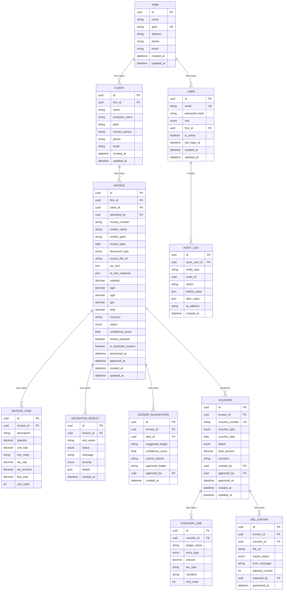

# Database Design

**Document Version:** 1.1  
**Last Updated:** August 2026

---

## 1. Design Goals

The database should support:

- Multi-user, multi-firm data isolation
- Complete invoice lifecycle tracking (upload → export)
- OCR and AI output traceability for debugging and auditing
- Voucher and export history with retry tracking
- Audit-friendly change logging with before/after snapshots
- Soft-delete support (no data permanently destroyed)

---

## 2. Entity Relationship Diagram



---

## 3. Field Specifications

### Enum Definitions

#### UserRole
```
ADMIN | OPERATOR | VIEWER
```

#### DocumentType
```
PDF_TEXT | PDF_SCANNED | IMAGE_JPG | IMAGE_PNG
```

#### InvoiceStatus
```
UPLOADED | PROCESSING | EXTRACTED | NEEDS_REVIEW | APPROVED | REJECTED | EXPORTED | FAILED
```

#### VoucherType
```
PURCHASE | SALES | JOURNAL | RECEIPT | PAYMENT
```

#### VoucherStatus
```
DRAFT | REVIEWED | APPROVED | EXPORTED | FAILED
```

#### ValidationStatus
```
PASS | FAIL | WARNING
```

#### ValidationSeverity
```
ERROR | WARNING | INFO
```

#### EntryType
```
DEBIT | CREDIT
```

#### ExportStatus
```
PENDING | SUCCESS | FAILED
```

---

## 4. Indexes and Constraints

### Unique Constraints

| Table | Columns | Purpose |
|-------|---------|---------|
| `User` | `email` | Prevent duplicate accounts |
| `Firm` | `gstin` | One firm per GSTIN |
| `Voucher` | `voucher_number` | Prevent duplicate voucher numbers |
| `Invoice` | `firm_id` + `vendor_gstin` + `invoice_number` | Duplicate detection |

### Composite Indexes

| Table | Columns | Purpose |
|-------|---------|---------|
| `Invoice` | `firm_id`, `status` | Fast filtered listing |
| `Invoice` | `firm_id`, `created_at` | Chronological listing |
| `Invoice` | `vendor_gstin`, `invoice_number` | Duplicate lookup |
| `Invoice` | `client_id`, `status` | Client-scoped queries |
| `Voucher` | `invoice_id`, `status` | Voucher lookup by invoice |
| `AuditLog` | `entity_type`, `entity_id` | Entity history lookup |
| `AuditLog` | `actor_user_id`, `created_at` | User activity audit |
| `XmlExport` | `voucher_id`, `export_status` | Export status lookup |

### Foreign Key Constraints

All foreign keys use `ON DELETE RESTRICT` to prevent accidental cascading deletions. Soft-delete is preferred.

---

## 5. Prisma Schema

```prisma
// prisma/schema.prisma

generator client {
  provider = "prisma-client-js"
}

datasource db {
  provider  = "postgresql"
  url       = env("DATABASE_URL")
  directUrl = env("DIRECT_URL")
}

// ─────────────────────────────────────
// Enums
// ─────────────────────────────────────

enum UserRole {
  ADMIN
  OPERATOR
  VIEWER
}

enum DocumentType {
  PDF_TEXT
  PDF_SCANNED
  IMAGE_JPG
  IMAGE_PNG
}

enum InvoiceStatus {
  UPLOADED
  PROCESSING
  EXTRACTED
  NEEDS_REVIEW
  APPROVED
  REJECTED
  EXPORTED
  FAILED
}

enum VoucherType {
  PURCHASE
  SALES
  JOURNAL
  RECEIPT
  PAYMENT
}

enum VoucherStatus {
  DRAFT
  REVIEWED
  APPROVED
  EXPORTED
  FAILED
}

enum ValidationStatus {
  PASS
  FAIL
  WARNING
}

enum ValidationSeverity {
  ERROR
  WARNING
  INFO
}

enum EntryType {
  DEBIT
  CREDIT
}

enum ExportStatus {
  PENDING
  SUCCESS
  FAILED
}

// ─────────────────────────────────────
// Models
// ─────────────────────────────────────

model Firm {
  id        String   @id @default(uuid())
  name      String
  gstin     String   @unique
  address   String?
  phone     String?
  email     String?
  createdAt DateTime @default(now()) @map("created_at")
  updatedAt DateTime @updatedAt @map("updated_at")

  users    User[]
  clients  Client[]
  invoices Invoice[]

  @@map("firms")
}

model User {
  id           String    @id @default(uuid())
  email        String    @unique
  passwordHash String?   @map("password_hash")
  role         UserRole  @default(OPERATOR)
  firmId       String    @map("firm_id")
  isActive     Boolean   @default(true) @map("is_active")
  lastLoginAt  DateTime? @map("last_login_at")
  createdAt    DateTime  @default(now()) @map("created_at")
  updatedAt    DateTime  @updatedAt @map("updated_at")

  firm              Firm              @relation(fields: [firmId], references: [id], onDelete: Restrict)
  uploadedInvoices  Invoice[]         @relation("UploadedBy")
  approvedLedgers   LedgerSuggestion[] @relation("ApprovedBy")
  createdVouchers   Voucher[]         @relation("CreatedBy")
  approvedVouchers  Voucher[]         @relation("ApprovedVoucherBy")
  xmlExports        XmlExport[]
  auditLogs         AuditLog[]

  @@map("users")
}

model Client {
  id            String   @id @default(uuid())
  firmId        String   @map("firm_id")
  name          String
  companyName   String?  @map("company_name")
  gstin         String?
  contactPerson String?  @map("contact_person")
  phone         String?
  email         String?
  createdAt     DateTime @default(now()) @map("created_at")
  updatedAt     DateTime @updatedAt @map("updated_at")

  firm     Firm      @relation(fields: [firmId], references: [id], onDelete: Restrict)
  invoices Invoice[]

  @@map("clients")
}

model Invoice {
  id                 String        @id @default(uuid())
  firmId             String        @map("firm_id")
  clientId           String?       @map("client_id")
  uploadedById       String        @map("uploaded_by")
  invoiceNumber      String?       @map("invoice_number")
  vendorName         String?       @map("vendor_name")
  vendorGstin        String?       @map("vendor_gstin")
  invoiceDate        DateTime?     @map("invoice_date") @db.Date
  documentType       DocumentType? @map("document_type")
  sourceFileUrl      String        @map("source_file_url")
  ocrText            String?       @map("ocr_text") @db.Text
  aiRawResponse      Json?         @map("ai_raw_response")
  subtotal           Decimal?      @db.Decimal(12, 2)
  cgst               Decimal?      @db.Decimal(12, 2)
  sgst               Decimal?      @db.Decimal(12, 2)
  igst               Decimal?      @db.Decimal(12, 2)
  total              Decimal?      @db.Decimal(12, 2)
  currency           String        @default("INR")
  status             InvoiceStatus @default(UPLOADED)
  confidenceScore    Float?        @map("confidence_score")
  reviewRequired     Boolean       @default(true) @map("review_required")
  isDuplicateSuspect Boolean       @default(false) @map("is_duplicate_suspect")
  processedAt        DateTime?     @map("processed_at")
  approvedAt         DateTime?     @map("approved_at")
  createdAt          DateTime      @default(now()) @map("created_at")
  updatedAt          DateTime      @updatedAt @map("updated_at")

  firm               Firm               @relation(fields: [firmId], references: [id], onDelete: Restrict)
  client             Client?            @relation(fields: [clientId], references: [id], onDelete: SetNull)
  uploadedBy         User               @relation("UploadedBy", fields: [uploadedById], references: [id], onDelete: Restrict)
  items              InvoiceItem[]
  validationResults  ValidationResult[]
  ledgerSuggestions  LedgerSuggestion[]
  vouchers           Voucher[]
  xmlExports         XmlExport[]

  @@unique([firmId, vendorGstin, invoiceNumber], name: "unique_invoice_per_vendor")
  @@index([firmId, status])
  @@index([firmId, createdAt])
  @@index([vendorGstin, invoiceNumber])
  @@index([clientId, status])
  @@map("invoices")
}

model InvoiceItem {
  id          String  @id @default(uuid())
  invoiceId   String  @map("invoice_id")
  description String
  quantity    Decimal @db.Decimal(10, 3)
  unitRate    Decimal @map("unit_rate") @db.Decimal(12, 2)
  hsnCode     String? @map("hsn_code")
  taxRate     Decimal @map("tax_rate") @db.Decimal(5, 2)
  taxAmount   Decimal @map("tax_amount") @db.Decimal(12, 2)
  lineTotal   Decimal @map("line_total") @db.Decimal(12, 2)
  sortOrder   Int     @default(0) @map("sort_order")

  invoice           Invoice            @relation(fields: [invoiceId], references: [id], onDelete: Cascade)
  ledgerSuggestions LedgerSuggestion[]

  @@map("invoice_items")
}

model ValidationResult {
  id        String             @id @default(uuid())
  invoiceId String             @map("invoice_id")
  ruleName  String             @map("rule_name")
  status    ValidationStatus
  message   String
  severity  ValidationSeverity
  details   Json?
  createdAt DateTime           @default(now()) @map("created_at")

  invoice Invoice @relation(fields: [invoiceId], references: [id], onDelete: Cascade)

  @@map("validation_results")
}

model LedgerSuggestion {
  id              String  @id @default(uuid())
  invoiceId       String  @map("invoice_id")
  itemId          String? @map("item_id")
  suggestedLedger String  @map("suggested_ledger")
  confidenceScore Float   @map("confidence_score")
  sourceReason    String? @map("source_reason")
  approvedLedger  String? @map("approved_ledger")
  approvedById    String? @map("approved_by")
  createdAt       DateTime @default(now()) @map("created_at")

  invoice    Invoice      @relation(fields: [invoiceId], references: [id], onDelete: Cascade)
  item       InvoiceItem? @relation(fields: [itemId], references: [id], onDelete: SetNull)
  approvedBy User?        @relation("ApprovedBy", fields: [approvedById], references: [id], onDelete: SetNull)

  @@map("ledger_suggestions")
}

model Voucher {
  id            String        @id @default(uuid())
  invoiceId     String        @map("invoice_id")
  voucherNumber String        @unique @map("voucher_number")
  voucherType   VoucherType   @map("voucher_type")
  voucherDate   DateTime      @map("voucher_date") @db.Date
  status        VoucherStatus @default(DRAFT)
  totalAmount   Decimal       @map("total_amount") @db.Decimal(12, 2)
  narration     String?
  createdById   String        @map("created_by")
  approvedById  String?       @map("approved_by")
  approvedAt    DateTime?     @map("approved_at")
  createdAt     DateTime      @default(now()) @map("created_at")
  updatedAt     DateTime      @updatedAt @map("updated_at")

  invoice    Invoice       @relation(fields: [invoiceId], references: [id], onDelete: Restrict)
  createdBy  User          @relation("CreatedBy", fields: [createdById], references: [id], onDelete: Restrict)
  approvedBy User?         @relation("ApprovedVoucherBy", fields: [approvedById], references: [id], onDelete: SetNull)
  lines      VoucherLine[]
  xmlExports XmlExport[]

  @@index([invoiceId, status])
  @@map("vouchers")
}

model VoucherLine {
  id         String    @id @default(uuid())
  voucherId  String    @map("voucher_id")
  ledgerName String    @map("ledger_name")
  entryType  EntryType @map("entry_type")
  amount     Decimal   @db.Decimal(12, 2)
  taxType    String?   @map("tax_type")
  narration  String?
  sortOrder  Int       @default(0) @map("sort_order")

  voucher Voucher @relation(fields: [voucherId], references: [id], onDelete: Cascade)

  @@map("voucher_lines")
}

model XmlExport {
  id            String       @id @default(uuid())
  invoiceId     String       @map("invoice_id")
  voucherId     String       @map("voucher_id")
  fileUrl       String?      @map("file_url")
  exportStatus  ExportStatus @default(PENDING) @map("export_status")
  errorMessage  String?      @map("error_message")
  attemptNumber Int          @default(1) @map("attempt_number")
  exportedById  String       @map("exported_by")
  generatedAt   DateTime     @default(now()) @map("generated_at")

  invoice    Invoice @relation(fields: [invoiceId], references: [id], onDelete: Restrict)
  voucher    Voucher @relation(fields: [voucherId], references: [id], onDelete: Restrict)
  exportedBy User    @relation(fields: [exportedById], references: [id], onDelete: Restrict)

  @@index([voucherId, exportStatus])
  @@map("xml_exports")
}

model AuditLog {
  id          String   @id @default(uuid())
  actorUserId String   @map("actor_user_id")
  entityType  String   @map("entity_type")
  entityId    String   @map("entity_id")
  action      String
  beforeValue Json?    @map("before_value")
  afterValue  Json?    @map("after_value")
  ipAddress   String?  @map("ip_address")
  createdAt   DateTime @default(now()) @map("created_at")

  actor User @relation(fields: [actorUserId], references: [id], onDelete: Restrict)

  @@index([entityType, entityId])
  @@index([actorUserId, createdAt])
  @@map("audit_logs")
}
```

---

## 6. Duplicate Detection Rules

Potential duplicate invoices are detected using a tiered approach:

| Tier | Match Criteria | Confidence |
|------|---------------|------------|
| **Exact Match** | `vendor_gstin` + `invoice_number` (unique constraint) | 100% — blocked at DB level |
| **Strong Match** | `vendor_name` + `invoice_number` + `total` | 95% — flagged as duplicate suspect |
| **Probable Match** | `invoice_date` proximity (±3 days) + `total` match (±1%) | 70% — flagged for review |

### Detection Algorithm

```text
1. Before saving a new invoice:
   a. Check unique constraint (firm_id + vendor_gstin + invoice_number)
   b. If passes, run soft match:
      - Query invoices with same vendor_name (fuzzy) AND invoice_number
      - Query invoices within ±3 days with same total ±1%
   c. If soft match found, set is_duplicate_suspect = true
   d. Flag for manual review
```

---

## 7. Row-Level Security Policies

All tables must enforce firm-level data isolation via Supabase RLS:

```sql
-- Example RLS policy for invoices table
CREATE POLICY "Users can only view invoices from their firm"
  ON invoices
  FOR SELECT
  USING (
    firm_id = (
      SELECT firm_id FROM users WHERE id = auth.uid()
    )
  );

CREATE POLICY "Users can only insert invoices for their firm"
  ON invoices
  FOR INSERT
  WITH CHECK (
    firm_id = (
      SELECT firm_id FROM users WHERE id = auth.uid()
    )
  );

-- Repeat pattern for all firm-scoped tables
```

---

## 8. Migration Strategy

### Development Workflow

```bash
# Create a new migration after schema changes
npx prisma migrate dev --name add_invoice_items

# Reset database (development only)
npx prisma migrate reset

# Apply migrations in production
npx prisma migrate deploy

# Generate Prisma Client
npx prisma generate
```

### Migration Naming Convention

```text
YYYYMMDD_HHMMSS_description
Example: 20260801_143000_add_invoice_items
```

### Rules

1. **Never edit** an existing migration file — create a new one
2. **Always review** the generated SQL before applying to production
3. **Test migrations** on a staging database first
4. **Back up** the database before applying production migrations
5. **Version control** all migration files in Git

---

## 9. Seed Data

```typescript
// prisma/seed.ts

import { PrismaClient, UserRole, VoucherType } from '@prisma/client';

const prisma = new PrismaClient();

async function main() {
  // Create a demo firm
  const firm = await prisma.firm.create({
    data: {
      name: 'Demo CA Firm',
      gstin: '27AABCU9603R1ZM',
      address: '123 Business Park, Mumbai, Maharashtra',
      phone: '+91-9876543210',
      email: 'admin@democafirm.com',
    },
  });

  // Create an admin user
  const admin = await prisma.user.create({
    data: {
      email: 'admin@democafirm.com',
      role: UserRole.ADMIN,
      firmId: firm.id,
    },
  });

  // Create an operator user
  const operator = await prisma.user.create({
    data: {
      email: 'priya@democafirm.com',
      role: UserRole.OPERATOR,
      firmId: firm.id,
    },
  });

  // Create sample clients
  const client = await prisma.client.create({
    data: {
      firmId: firm.id,
      name: 'ABC Traders',
      companyName: 'ABC Trading Co. Pvt. Ltd.',
      gstin: '27ABCDE1234F1Z5',
      contactPerson: 'Suresh Kumar',
      phone: '+91-9123456789',
      email: 'suresh@abctraders.com',
    },
  });

  console.log('Seed data created successfully');
  console.log({ firm, admin, operator, client });
}

main()
  .catch(console.error)
  .finally(() => prisma.$disconnect());
```
