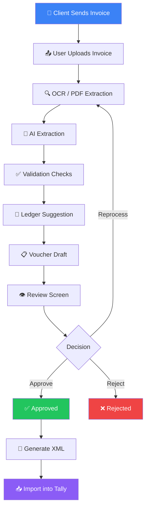
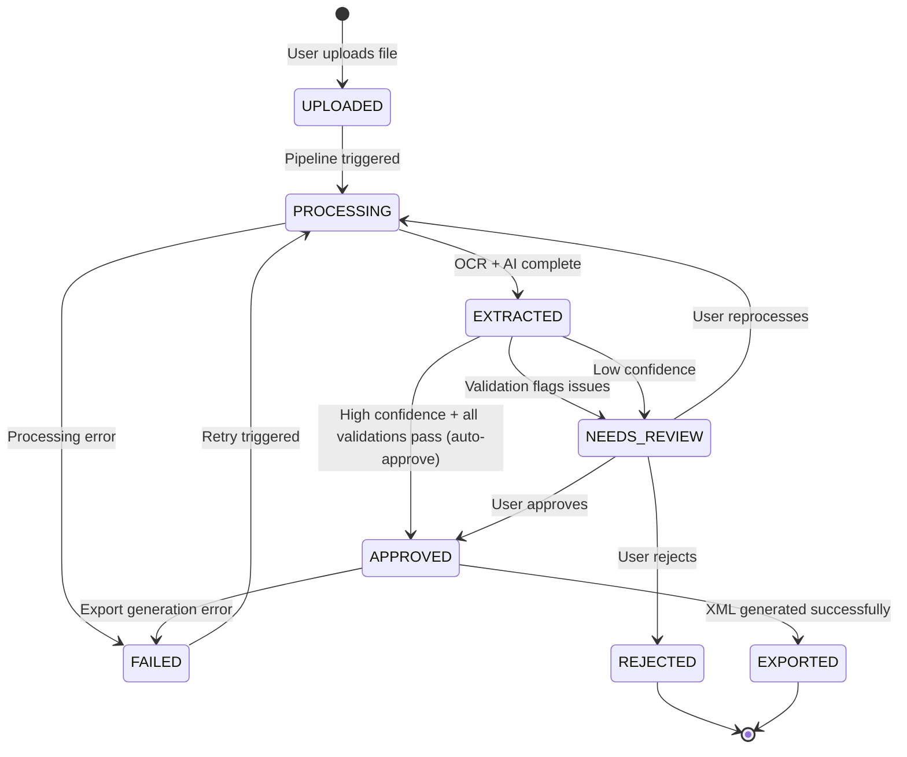
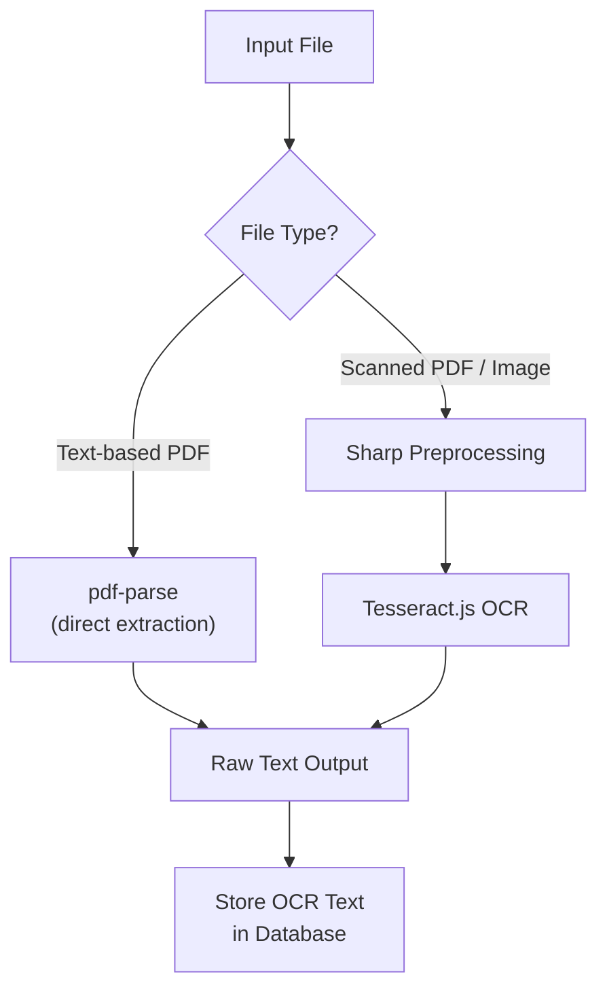
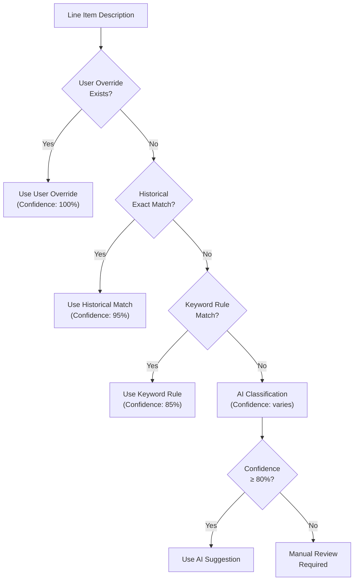
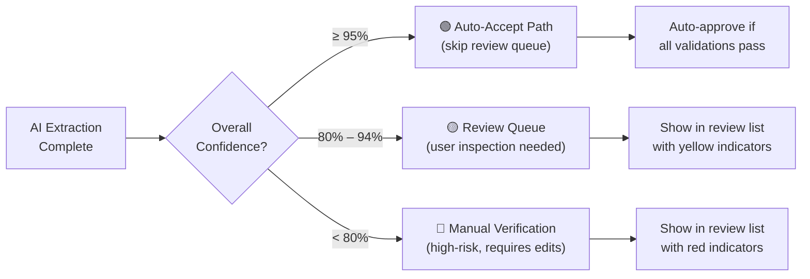
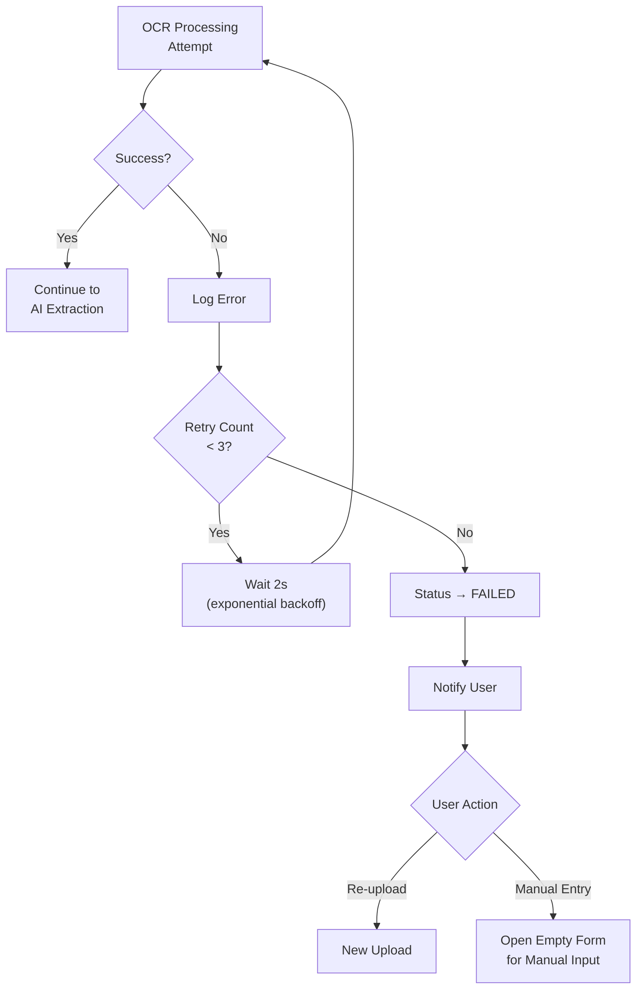
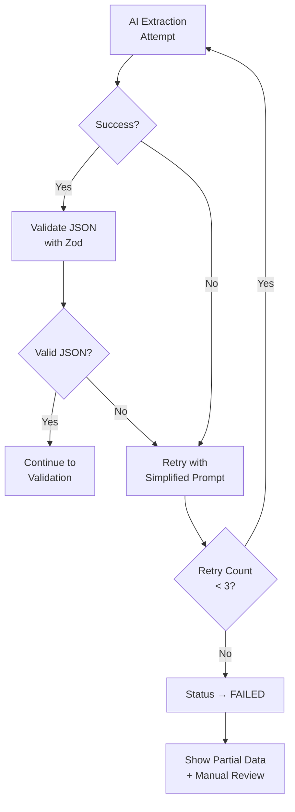
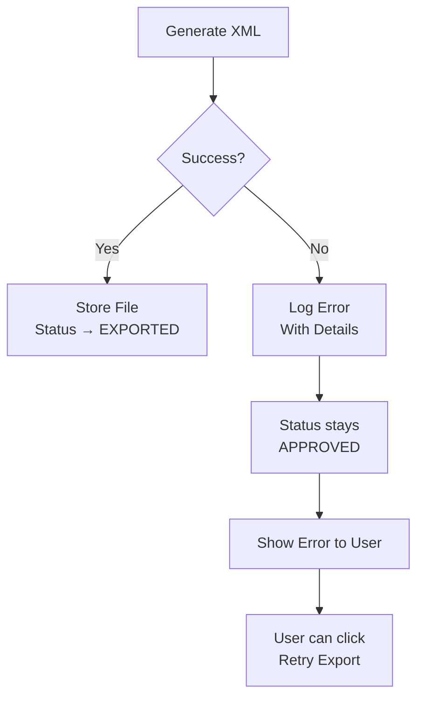

# Features and Workflows

**Document Version:** 1.1  
**Last Updated:** August 2026

---

## 1. Core User Workflow



---

## 2. Invoice Status State Machine



### Status Transition Rules

| From | To | Trigger | Requirements |
|------|-----|---------|-------------|
| `UPLOADED` | `PROCESSING` | System automatic | File stored successfully |
| `PROCESSING` | `EXTRACTED` | System automatic | OCR + AI complete, no critical errors |
| `PROCESSING` | `FAILED` | System automatic | OCR or AI pipeline error |
| `EXTRACTED` | `NEEDS_REVIEW` | System automatic | Any validation warning/error OR confidence < 95% |
| `EXTRACTED` | `APPROVED` | System automatic | All validations pass AND confidence ≥ 95% |
| `NEEDS_REVIEW` | `APPROVED` | User action | User clicks "Approve" |
| `NEEDS_REVIEW` | `REJECTED` | User action | User clicks "Reject" + provides reason |
| `NEEDS_REVIEW` | `PROCESSING` | User action | User clicks "Reprocess" |
| `APPROVED` | `EXPORTED` | System automatic | XML generated and stored |
| `FAILED` | `PROCESSING` | User action | User clicks "Retry" (max 3 attempts) |

---

## 3. Feature Breakdown

### Feature 1: Invoice Upload

**Purpose:** Accept invoice documents from the user and prepare them for processing.

#### Capabilities

| Capability | Details | Priority |
|-----------|---------|----------|
| PDF upload | Accept `.pdf` files up to 10 MB | Must |
| Image upload | Accept `.jpg`, `.png` files up to 5 MB | Must |
| Drag and drop | Drop zone with visual feedback | Should |
| File preview | Thumbnail or embedded PDF viewer | Should |
| Upload status | Progress bar + success/error toast | Must |
| Batch upload | Upload multiple files at once | Could |

#### Wireframe Description — Upload Screen

```
┌──────────────────────────────────────────────────────────────┐
│  CA AI    [Dashboard]  [Invoices]  [Clients]  [Settings]  👤 │
├──────────────────────────────────────────────────────────────┤
│                                                              │
│  📤 Upload Invoices                                          │
│  ─────────────────                                           │
│                                                              │
│  ┌────────────────────────────────────────────────────────┐  │
│  │                                                        │  │
│  │     ┌──────────┐                                       │  │
│  │     │  📄 icon  │    Drag and drop invoice files here  │  │
│  │     └──────────┘    or click to browse                 │  │
│  │                                                        │  │
│  │     Supported: PDF, JPG, PNG (max 10 MB)               │  │
│  │                                                        │  │
│  └────────────────────────────────────────────────────────┘  │
│                                                              │
│  Queued Files (3)                                            │
│  ┌─────────────────────────────────┬────────┬────────────┐  │
│  │ invoice-july-001.pdf  (1.2 MB)  │ ██████ │  Processing│  │
│  │ scan-vendor-abc.jpg   (800 KB)  │ ████── │  Uploading │  │
│  │ receipt-2026.png      (500 KB)  │ ────── │  Queued    │  │
│  └─────────────────────────────────┴────────┴────────────┘  │
│                                                              │
│  [Cancel All]                              [Process All →]   │
│                                                              │
└──────────────────────────────────────────────────────────────┘
```

---

### Feature 2: OCR & Text Extraction

**Purpose:** Convert invoice documents (PDFs and images) into raw text for AI processing.

#### Two-Path Strategy



#### OCR Target Fields

| Field | OCR Priority | Typical Location on Invoice |
|-------|-------------|---------------------------|
| Invoice number | Critical | Top-right header |
| Invoice date | Critical | Near invoice number |
| Vendor name | Critical | Top-left or letterhead |
| GSTIN | Critical | Below vendor name |
| Item descriptions | Critical | Line items table |
| HSN / SAC code | High | Line items table |
| Rate / Unit price | High | Line items table |
| Quantity | High | Line items table |
| Tax values | High | Summary section at bottom |
| Total | Critical | Bottom of invoice |

---

### Feature 3: AI Extraction

**Purpose:** Transform raw OCR text into structured JSON accounting data using LLM.

#### Expected Output Format

```json
{
  "invoice_number": "INV-2045",
  "invoice_date": "2026-07-22",
  "vendor_name": "ABC Traders",
  "vendor_gstin": "27ABCDE1234F1Z5",
  "items": [
    {
      "description": "Laptop Dell Inspiron 15",
      "quantity": 2,
      "rate": 55000.00,
      "hsn_code": "8471",
      "tax_rate": 18,
      "tax_amount": 19800.00,
      "line_total": 129800.00
    }
  ],
  "subtotal": 110000.00,
  "cgst": 9900.00,
  "sgst": 9900.00,
  "igst": 0,
  "total": 129800.00,
  "confidence": {
    "overall": 0.92,
    "invoice_number": 0.98,
    "vendor_name": 0.95,
    "vendor_gstin": 0.97,
    "items": 0.88,
    "totals": 0.90
  }
}
```

---

### Feature 4: Validation Engine

**Purpose:** Automatically verify extracted data quality before human review.

#### Validation Rules Matrix

| Rule | Check | Severity | Auto-Action |
|------|-------|----------|------------|
| `GSTIN_FORMAT` | GSTIN matches `\d{2}[A-Z]{5}\d{4}[A-Z]{1}[A-Z\d]{1}[Z]{1}[A-Z\d]{1}` | Error | Block auto-approve |
| `GSTIN_CHECKSUM` | GSTIN check digit is valid | Warning | Flag for review |
| `INVOICE_NUMBER_PRESENT` | Invoice number is non-empty | Error | Block auto-approve |
| `VENDOR_NAME_PRESENT` | Vendor name is non-empty | Error | Block auto-approve |
| `TOTAL_POSITIVE` | Total > 0 | Error | Block auto-approve |
| `DATE_VALID` | Date is parseable, not in future, not > 1 year old | Warning | Flag for review |
| `ITEMS_ARITHMETIC` | Sum of line items = subtotal (±0.50 tolerance) | Warning | Flag for review |
| `TAX_ARITHMETIC` | Subtotal + CGST + SGST + IGST = total (±1.00 tolerance) | Warning | Flag for review |
| `TAX_SPLIT_LOGIC` | If IGST > 0, then CGST and SGST should be 0 (and vice versa) | Warning | Flag for review |
| `DUPLICATE_CHECK` | No existing invoice with same vendor GSTIN + invoice number | Error | Block auto-approve, flag suspect |
| `DATE_PROXIMITY_DUPLICATE` | No existing invoice within ±3 days with same total ±1% | Warning | Flag for review |

---

### Feature 5: Ledger Suggestion

**Purpose:** Automatically classify each invoice line item into the correct accounting ledger.

#### Suggestion Priority Order



#### Example Keyword Rules

| Keyword / Pattern | Suggested Ledger | Category |
|------------------|-----------------|----------|
| Laptop, Computer, Desktop, Monitor | Computer & IT Equipment | Asset |
| Freight, Transport, Courier, Shipping | Freight Charges | Expense |
| Fuel, Diesel, Petrol, CNG | Fuel Expense | Expense |
| Electricity, Power, MSEB | Electricity Expense | Expense |
| Stationery, Paper, Printer Ink | Printing & Stationery | Expense |
| Rent, Lease, Office Space | Rent Expense | Expense |
| Mobile, Internet, Broadband, Telecom | Communication Expense | Expense |
| Furniture, Chair, Table, Desk | Furniture & Fixtures | Asset |
| Legal, Consultation, Advisory | Professional Fees | Expense |
| Insurance, Premium, Policy | Insurance Expense | Expense |

---

### Feature 6: Voucher Generator

**Purpose:** Create accounting voucher drafts from validated invoice data.

#### Voucher Type Selection Logic

| Document Context | Voucher Type | Debit | Credit |
|-----------------|-------------|-------|--------|
| Purchase invoice received | Purchase | Expense/Asset Ledger + GST Input | Vendor/Creditor |
| Sales invoice issued | Sales | Customer/Debtor | Revenue Ledger + GST Output |
| Adjustment entry | Journal | Varies | Varies |
| Payment received | Receipt | Bank/Cash | Customer/Debtor |
| Payment made | Payment | Vendor/Creditor | Bank/Cash |

#### Example: Purchase Voucher Lines

For a laptop purchase of ₹55,000 + 18% GST (intra-state):

| # | Ledger Name | Entry Type | Amount (₹) |
|---|-------------|-----------|------------|
| 1 | Computer & IT Equipment | Debit | 55,000.00 |
| 2 | CGST Input (9%) | Debit | 4,950.00 |
| 3 | SGST Input (9%) | Debit | 4,950.00 |
| 4 | ABC Traders (Creditor) | Credit | 64,900.00 |

---

### Feature 7: Review Screen

**Purpose:** Allow accountants to verify AI-extracted data, make corrections, and approve or reject entries.

#### Wireframe Description — Invoice Review Screen

```
┌──────────────────────────────────────────────────────────────┐
│  CA AI    [Dashboard]  [Invoices]  [Clients]  [Settings]  👤 │
├──────────────────────────────────────────────────────────────┤
│                                                              │
│  Invoice #INV-2045  ·  ABC Traders  ·  ₹64,900.00           │
│  Status: 🟡 Needs Review    Confidence: 92%                  │
│  ─────────────────────────────────────────────────────────── │
│                                                              │
│  ┌─────────────────────────┬─────────────────────────────┐  │
│  │                         │                             │  │
│  │   📄 Original Document  │   📝 Extracted Data         │  │
│  │                         │                             │  │
│  │   [PDF/Image Viewer]    │   Invoice No: [INV-2045  ]  │  │
│  │                         │   Date:       [2026-07-22]  │  │
│  │   ← → 🔍+ 🔍-          │   Vendor:     [ABC Traders] │  │
│  │                         │   GSTIN:      [27ABCDE...] ⚠│  │
│  │                         │                             │  │
│  │                         │   Line Items:               │  │
│  │                         │   ┌────┬──────┬─────┬─────┐│  │
│  │                         │   │Desc│ Qty  │Rate │Total ││  │
│  │                         │   ├────┼──────┼─────┼─────┤│  │
│  │                         │   │Lapt│  2   │55000│129800││  │
│  │                         │   └────┴──────┴─────┴─────┘│  │
│  │                         │                             │  │
│  │                         │   Subtotal: ₹1,10,000.00    │  │
│  │                         │   CGST:     ₹9,900.00       │  │
│  │                         │   SGST:     ₹9,900.00       │  │
│  │                         │   Total:    ₹1,29,800.00    │  │
│  │                         │                             │  │
│  └─────────────────────────┴─────────────────────────────┘  │
│                                                              │
│  ⚠️ Validation Warnings:                                    │
│  ┌──────────────────────────────────────────────────────┐   │
│  │ ⚠ GSTIN checksum mismatch — verify manually         │   │
│  │ ℹ Ledger "Computer & IT Equipment" suggested (88%)   │   │
│  └──────────────────────────────────────────────────────┘   │
│                                                              │
│  Voucher Preview:                                            │
│  ┌─────────────────────┬────────┬───────────┐               │
│  │ Computer & IT Equip │ Debit  │ 1,10,000  │               │
│  │ CGST Input (9%)     │ Debit  │ 9,900     │               │
│  │ SGST Input (9%)     │ Debit  │ 9,900     │               │
│  │ ABC Traders         │ Credit │ 1,29,800  │               │
│  └─────────────────────┴────────┴───────────┘               │
│                                                              │
│  [← Back]   [🔄 Reprocess]   [❌ Reject]   [✅ Approve →]   │
│                                                              │
└──────────────────────────────────────────────────────────────┘
```

#### Review Screen Requirements

| Capability | Details |
|-----------|---------|
| Side-by-side view | Original document on left, extracted data on right |
| Inline editing | Click any extracted field to edit in-place |
| Confidence indicators | Color-coded per field (🟢 green ≥95%, 🟡 yellow 80–94%, 🔴 red <80%) |
| Validation warnings | Listed below extracted data with severity icons |
| Voucher preview | Accounting entries shown before approval |
| Keyboard shortcuts | `Ctrl+Enter` = Approve, `Ctrl+R` = Reject, `Ctrl+Shift+R` = Reprocess |
| Audit trail | All edits logged with before/after values |

---

### Feature 8: Tally XML Export

**Purpose:** Generate import-ready XML files for Tally Prime.

| Capability | Details |
|-----------|---------|
| Generate XML | One-click export for approved vouchers |
| Download file | XML file downloaded to user's machine |
| Store history | Export attempt, status, and file URL recorded |
| Display status | Success/failure shown with error details |
| Re-export | Allow regeneration if first attempt fails |
| Batch export | Export multiple approved vouchers at once (Phase 2) |

---

## 4. Confidence-Based Review Rules

### Confidence Thresholds



### Per-Field Confidence Display

| Confidence | Visual | User Expectation |
|-----------|--------|-----------------|
| ≥ 95% | 🟢 Green background | Likely correct, quick glance sufficient |
| 80% – 94% | 🟡 Yellow background | Probably correct, verify against source |
| < 80% | 🔴 Red background | Likely wrong or uncertain, must verify and edit |

---

## 5. Error Handling Workflows

### OCR Failure



### AI Extraction Failure



### XML Export Failure



---

## 6. Notification Specifications

| Event | Notification Type | Channel | Recipients |
|-------|------------------|---------|-----------|
| Invoice upload complete | Toast (success) | In-app | Uploader |
| Processing complete | Toast + badge update | In-app | Uploader |
| Processing failed | Toast (error) | In-app | Uploader |
| Invoice needs review | Badge on sidebar | In-app | All operators in firm |
| Invoice approved | Toast (success) | In-app | Reviewer |
| Export complete | Toast + download prompt | In-app | Exporter |
| Export failed | Toast (error) | In-app | Exporter |
| Duplicate detected | Alert banner on review | In-app | Reviewer |

---

## 7. Dashboard

### Wireframe Description — Dashboard Screen

```
┌──────────────────────────────────────────────────────────────┐
│  CA AI    [Dashboard]  [Invoices]  [Clients]  [Settings]  👤 │
├──────────────────────────────────────────────────────────────┤
│                                                              │
│  Good morning, Priya 👋                    August 5, 2026    │
│  ─────────────────────────────────────────────────────────── │
│                                                              │
│  ┌──────────┐ ┌──────────┐ ┌──────────┐ ┌──────────┐       │
│  │ 📊 47    │ │ 🟡 12    │ │ ✅ 31    │ │ ❌ 4     │       │
│  │ Total    │ │ Pending  │ │ Approved │ │ Failed   │       │
│  │ Today    │ │ Review   │ │ Today    │ │ Today    │       │
│  └──────────┘ └──────────┘ └──────────┘ └──────────┘       │
│                                                              │
│  ┌────────────────────────────┬───────────────────────────┐  │
│  │                            │                           │  │
│  │  📈 Daily Throughput       │  📊 Status Breakdown      │  │
│  │  (Line chart — 7 days)     │  (Donut chart)            │  │
│  │                            │                           │  │
│  │  Mon Tue Wed Thu Fri Sat   │     ██ Approved  65%      │  │
│  │   35  42  38  50  47  --   │     ██ Reviewing 25%      │  │
│  │                            │     ██ Failed     8%      │  │
│  │                            │     ██ Other      2%      │  │
│  └────────────────────────────┴───────────────────────────┘  │
│                                                              │
│  ⏳ Recent Invoices Needing Review                           │
│  ┌────────┬──────────────┬──────────┬───────┬─────────┐     │
│  │ #      │ Vendor       │ Amount   │ Conf. │ Action  │     │
│  ├────────┼──────────────┼──────────┼───────┼─────────┤     │
│  │ INV-45 │ ABC Traders  │ ₹64,900  │ 88%   │ [Review]│     │
│  │ INV-44 │ XYZ Corp     │ ₹12,300  │ 72%   │ [Review]│     │
│  │ INV-43 │ PQR Services │ ₹8,500   │ 91%   │ [Review]│     │
│  └────────┴──────────────┴──────────┴───────┴─────────┘     │
│                                                              │
└──────────────────────────────────────────────────────────────┘
```

### Dashboard Widgets

| Widget | Data Source | Refresh |
|--------|-----------|---------|
| Total invoices today | Count of invoices created today | Real-time |
| Pending review | Count where status = `NEEDS_REVIEW` | Real-time |
| Approved today | Count where status = `APPROVED` and approved today | Real-time |
| Failed today | Count where status = `FAILED` and created today | Real-time |
| Daily throughput chart | 7-day count by status | Every 5 min |
| Status breakdown donut | Current distribution of all statuses | Every 5 min |
| Recent needing review | Top 10 oldest `NEEDS_REVIEW` invoices | Real-time |

---

## 8. Future User-Facing Modules

| Module | Phase | Description |
|--------|-------|-------------|
| GST Reports | Phase 2 | GSTR-1, GSTR-3B summary generation |
| Purchase Register | Phase 2 | Chronological purchase ledger |
| Sales Register | Phase 2 | Chronological sales ledger |
| Bank Reconciliation | Phase 3 | Match bank statements with vouchers |
| AI Audit Assistant | Phase 3 | Automated compliance checks |
| Reports Center | Phase 2 | Customizable financial reports |
| Client Portal | Phase 3 | Client self-service invoice submission |

---

## 9. Edge Case Matrix

| Scenario | Expected Behavior | Fallback |
|----------|-------------------|----------|
| Blurry/unreadable scan | OCR returns low-confidence text, AI flags low confidence | Move to manual entry |
| Multi-page invoice | Concatenate OCR text from all pages | Process as single document |
| Non-English invoice | AI attempts extraction, likely low confidence | Flag for manual review |
| Invoice with no GSTIN | Validation flags missing GSTIN as error | Allow manual entry |
| Invoice with handwritten values | OCR may partially extract | Flag for manual review |
| Corrupted PDF | pdf-parse throws error | Show upload error, ask to re-upload |
| Zero-amount invoice | Validation flags as warning | Allow if user confirms |
| Credit note (negative total) | AI should detect as credit note | Map to journal voucher |
| Duplicate upload (same file) | File hash comparison | Warn user before processing |
| API rate limit (Groq) | Queue request, retry after cooldown | Exponential backoff |
