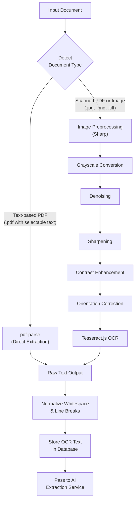
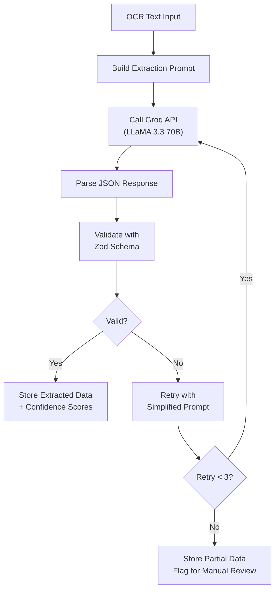
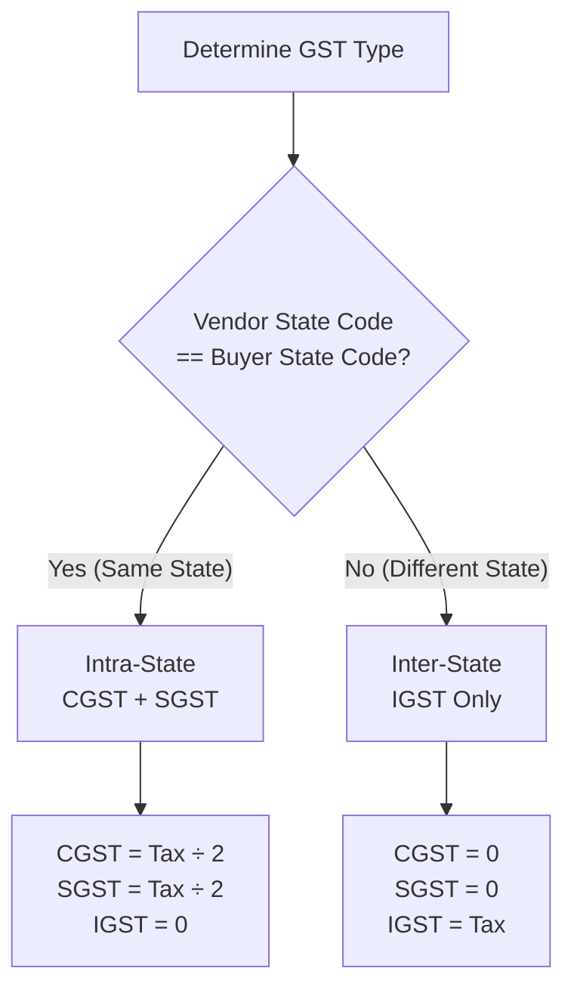
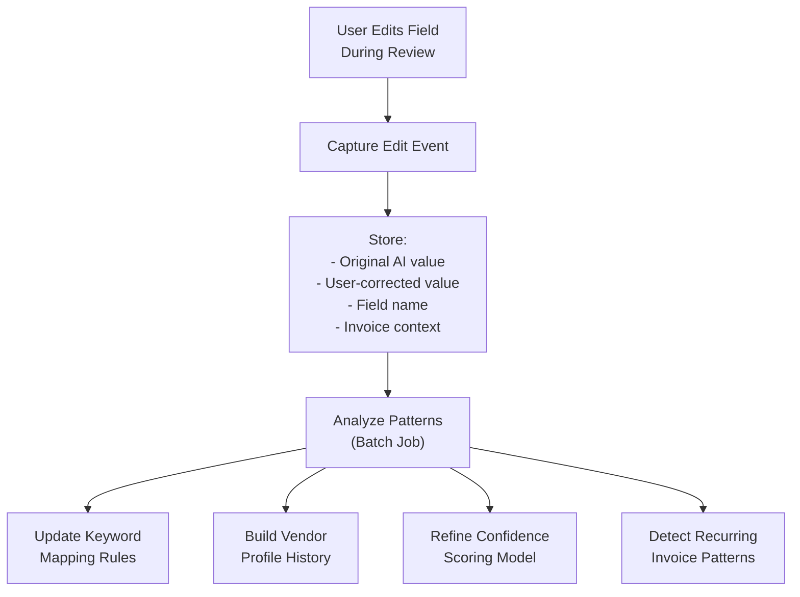

# AI, OCR, and Voucher Specification

**Document Version:** 1.1  
**Last Updated:** August 2026

---

## 1. OCR Strategy

Use a two-path extraction model to handle both machine-readable and scanned documents:



### Document Type Detection

```typescript
// Pseudo-code for document type detection
async function detectDocumentType(file: Buffer, mimeType: string): Promise<DocumentType> {
  if (mimeType === 'application/pdf') {
    const text = await pdfParse(file);
    if (text.text.trim().length > 50) {
      return 'PDF_TEXT';      // Has selectable text
    }
    return 'PDF_SCANNED';     // Scanned PDF (no selectable text)
  }
  
  if (['image/jpeg', 'image/png'].includes(mimeType)) {
    return mimeType === 'image/jpeg' ? 'IMAGE_JPG' : 'IMAGE_PNG';
  }
  
  throw new Error('Unsupported file type');
}
```

### Image Preprocessing Pipeline

| Step | Sharp Operation | Purpose |
|------|----------------|---------|
| 1. Grayscale | `.grayscale()` | Remove color noise |
| 2. Denoise | `.median(3)` | Reduce scanner artifacts |
| 3. Sharpen | `.sharpen({ sigma: 1.5 })` | Enhance text edges |
| 4. Contrast | `.normalize()` | Improve text/background separation |
| 5. Orientation | `.rotate()` with EXIF | Correct rotated scans |
| 6. Resize | `.resize(2000, null, { withoutEnlargement: true })` | Optimal resolution for Tesseract |

### OCR Configuration

```typescript
// Tesseract.js configuration
const ocrConfig = {
  lang: 'eng+hin',           // English + Hindi support
  tessedit_pageseg_mode: '6', // Assume uniform block of text
  tessedit_char_whitelist: '0123456789ABCDEFGHIJKLMNOPQRSTUVWXYZabcdefghijklmnopqrstuvwxyz.,/-:@#%&()₹ ',
};
```

---

## 2. AI Extraction Service

### Architecture



### Required Extraction Fields

| Field | Type | Required | Validation |
|-------|------|----------|-----------|
| `invoice_number` | `string` | ✅ | Non-empty, preserve original formatting |
| `invoice_date` | `string` (ISO 8601) | ✅ | Parseable date, not in future |
| `vendor_name` | `string` | ✅ | Non-empty |
| `vendor_gstin` | `string` | ✅ | 15-char alphanumeric GSTIN format |
| `items` | `array` | ✅ | At least 1 item |
| `items[].description` | `string` | ✅ | Non-empty |
| `items[].quantity` | `number` | ✅ | > 0 |
| `items[].rate` | `number` | ✅ | > 0 |
| `items[].hsn_code` | `string` | ❌ | 4–8 digit numeric |
| `items[].tax_rate` | `number` | ❌ | 0, 5, 12, 18, or 28 |
| `items[].tax_amount` | `number` | ✅ | ≥ 0 |
| `items[].line_total` | `number` | ✅ | > 0 |
| `subtotal` | `number` | ✅ | > 0 |
| `cgst` | `number` | ✅ | ≥ 0 |
| `sgst` | `number` | ✅ | ≥ 0 |
| `igst` | `number` | ✅ | ≥ 0 |
| `total` | `number` | ✅ | > 0 |

### Recommended Extra Fields

| Field | Type | Purpose |
|-------|------|---------|
| `place_of_supply` | `string` | Determines intra/inter-state GST |
| `invoice_type` | `string` | "Tax Invoice", "Credit Note", etc. |
| `payment_terms` | `string` | "Net 30", "Due on Receipt", etc. |
| `transport_reference` | `string` | Bill of lading, LR number |
| `buyer_gstin` | `string` | Buyer's GSTIN for cross-verification |

---

## 3. Extraction Prompts

### Primary Prompt — Purchase / Sales Invoice

```text
You are an expert accounting document extraction assistant specializing in Indian invoices.

Extract invoice data from the OCR text below. Return valid JSON only — no markdown, no commentary, no explanation.

Required fields:
- invoice_number (string, preserve exact formatting)
- invoice_date (string, ISO 8601 format YYYY-MM-DD)
- vendor_name (string)
- vendor_gstin (string, 15-character alphanumeric)
- items (array of objects with: description, quantity, rate, hsn_code, tax_rate, tax_amount, line_total)
- subtotal (number)
- cgst (number, 0 if not applicable)
- sgst (number, 0 if not applicable)
- igst (number, 0 if not applicable)
- total (number)

Rules:
- Use null for genuinely missing values (not zero)
- Keep all monetary values as numbers (no currency symbols)
- Preserve invoice number formatting exactly as it appears
- If tax is split into CGST+SGST, set igst to 0
- If tax is IGST only, set cgst and sgst to 0
- quantity and rate must be positive numbers
- hsn_code should be the numeric code only (no text)

OCR Text:
---
{ocr_text}
---
```

### Fallback Prompt — Simplified (for retries)

```text
Extract these fields from the invoice text. Return JSON only.

Fields: invoice_number, invoice_date, vendor_name, vendor_gstin, subtotal, cgst, sgst, igst, total, items (array with description, quantity, rate, line_total)

Use null for missing values. Numbers only for amounts.

Text:
---
{ocr_text}
---
```

### Ledger Suggestion Prompt

```text
You are an Indian accounting classification assistant.

Given the invoice line items below, suggest the most appropriate Tally ledger name for each item. Use standard Indian accounting ledger names.

Return JSON array with: item_description, suggested_ledger, confidence (0.0 to 1.0), reasoning.

Common ledger categories: Purchase Account, Sales Account, Computer & IT Equipment, Furniture & Fixtures, Office Supplies, Freight Charges, Professional Fees, Rent, Electricity, Communication Expense, Fuel Expense, Printing & Stationery, Insurance, Repairs & Maintenance.

Items:
{items_json}
```

---

## 4. Zod Validation Schema

```typescript
import { z } from 'zod';

// Schema for a single invoice line item
const InvoiceItemSchema = z.object({
  description: z.string().min(1, 'Item description is required'),
  quantity: z.number().positive('Quantity must be positive'),
  rate: z.number().positive('Rate must be positive'),
  hsn_code: z.string().regex(/^\d{4,8}$/, 'HSN code must be 4-8 digits').nullable(),
  tax_rate: z.number().min(0).max(100).nullable(),
  tax_amount: z.number().min(0, 'Tax amount cannot be negative'),
  line_total: z.number().positive('Line total must be positive'),
});

// Schema for the complete AI extraction response
export const AIExtractionSchema = z.object({
  invoice_number: z.string().min(1, 'Invoice number is required'),
  invoice_date: z.string().regex(
    /^\d{4}-\d{2}-\d{2}$/,
    'Date must be in YYYY-MM-DD format'
  ),
  vendor_name: z.string().min(1, 'Vendor name is required'),
  vendor_gstin: z.string().regex(
    /^\d{2}[A-Z]{5}\d{4}[A-Z]{1}[A-Z\d]{1}[Z]{1}[A-Z\d]{1}$/,
    'Invalid GSTIN format'
  ).nullable(),
  items: z.array(InvoiceItemSchema).min(1, 'At least one item is required'),
  subtotal: z.number().positive('Subtotal must be positive'),
  cgst: z.number().min(0, 'CGST cannot be negative'),
  sgst: z.number().min(0, 'SGST cannot be negative'),
  igst: z.number().min(0, 'IGST cannot be negative'),
  total: z.number().positive('Total must be positive'),
});

// Schema for ledger suggestion response
export const LedgerSuggestionSchema = z.array(z.object({
  item_description: z.string(),
  suggested_ledger: z.string(),
  confidence: z.number().min(0).max(1),
  reasoning: z.string(),
}));

// Type inference
export type AIExtractionResult = z.infer<typeof AIExtractionSchema>;
export type LedgerSuggestionResult = z.infer<typeof LedgerSuggestionSchema>;
```

---

## 5. Example JSON Output

### Successful Extraction

```json
{
  "invoice_number": "INV-2045",
  "invoice_date": "2026-07-22",
  "vendor_name": "ABC Traders",
  "vendor_gstin": "27ABCDE1234F1Z5",
  "items": [
    {
      "description": "Laptop Dell Inspiron 15",
      "quantity": 1,
      "rate": 55000,
      "hsn_code": "8471",
      "tax_rate": 18,
      "tax_amount": 9900,
      "line_total": 64900
    },
    {
      "description": "Laptop Bag",
      "quantity": 1,
      "rate": 1500,
      "hsn_code": "4202",
      "tax_rate": 18,
      "tax_amount": 270,
      "line_total": 1770
    }
  ],
  "subtotal": 56500,
  "cgst": 5085,
  "sgst": 5085,
  "igst": 0,
  "total": 66670
}
```

### Partial Extraction (Low Confidence)

```json
{
  "invoice_number": "INV-2045",
  "invoice_date": "2026-07-22",
  "vendor_name": "ABC Traders",
  "vendor_gstin": null,
  "items": [
    {
      "description": "Laptop",
      "quantity": 1,
      "rate": 55000,
      "hsn_code": null,
      "tax_rate": null,
      "tax_amount": 9900,
      "line_total": 64900
    }
  ],
  "subtotal": 55000,
  "cgst": 4950,
  "sgst": 4950,
  "igst": 0,
  "total": 64900
}
```

---

## 6. Validation Rules (Detailed)

### Field Validation

| Rule ID | Check | Implementation | Severity |
|---------|-------|---------------|----------|
| `V001` | Invoice number exists | `invoice_number != null && invoice_number.length > 0` | Error |
| `V002` | Vendor name exists | `vendor_name != null && vendor_name.length > 0` | Error |
| `V003` | Total is positive | `total > 0` | Error |
| `V004` | Date is parseable | `!isNaN(Date.parse(invoice_date))` | Error |
| `V005` | Date is not in future | `new Date(invoice_date) <= new Date()` | Warning |
| `V006` | Date is not > 1 year old | `daysDiff <= 365` | Warning |

### GST Validation

| Rule ID | Check | Implementation | Severity |
|---------|-------|---------------|----------|
| `V010` | GSTIN format matches | Regex: `^\d{2}[A-Z]{5}\d{4}[A-Z]{1}[A-Z\d]{1}Z[A-Z\d]{1}$` | Error |
| `V011` | GSTIN state code valid | First 2 digits between 01–38 | Warning |
| `V012` | Tax split is consistent | If `igst > 0` then `cgst == 0 && sgst == 0` (and vice versa) | Warning |
| `V013` | CGST equals SGST | For intra-state, `cgst == sgst` | Warning |
| `V014` | Tax rate is standard | Tax rate ∈ {0, 5, 12, 18, 28} | Info |

### Arithmetic Validation

| Rule ID | Check | Tolerance | Severity |
|---------|-------|-----------|----------|
| `V020` | Sum of item line_totals = subtotal + tax | ±₹1.00 | Warning |
| `V021` | subtotal + cgst + sgst + igst = total | ±₹1.00 | Warning |
| `V022` | Each item: quantity × rate = line_total - tax_amount | ±₹0.50 | Info |
| `V023` | Voucher total = invoice total | Exact match | Error |

### Duplicate Detection

| Rule ID | Check | Confidence | Severity |
|---------|-------|-----------|----------|
| `V030` | Same `vendor_gstin` + `invoice_number` in same firm | 100% | Error (DB constraint) |
| `V031` | Same `vendor_name` + `invoice_number` + `total` | 95% | Error |
| `V032` | Same `total` within ±3 days from same vendor | 70% | Warning |

---

## 7. GST Calculation Rules

### Intra-State vs Inter-State



### GST Rate Slabs (India)

| Rate | Applicable Items (Examples) |
|------|---------------------------|
| **0%** | Essential food grains, milk, eggs, fresh vegetables |
| **5%** | Branded food items, coal, fertilizers, footwear < ₹1000 |
| **12%** | Processed food, IT services, business class air travel |
| **18%** | Most goods and services — electronics, financial services, restaurants |
| **28%** | Luxury goods — automobiles, cement, aerated beverages |

### State Code Reference (First 2 digits of GSTIN)

| Code | State | Code | State |
|------|-------|------|-------|
| 01 | Jammu & Kashmir | 20 | Jharkhand |
| 02 | Himachal Pradesh | 21 | Odisha |
| 03 | Punjab | 22 | Chhattisgarh |
| 04 | Chandigarh | 23 | Madhya Pradesh |
| 05 | Uttarakhand | 24 | Gujarat |
| 06 | Haryana | 25 | Daman & Diu |
| 07 | Delhi | 26 | Dadra & Nagar Haveli |
| 08 | Rajasthan | 27 | Maharashtra |
| 09 | Uttar Pradesh | 28 | Andhra Pradesh |
| 10 | Bihar | 29 | Karnataka |
| 11 | Sikkim | 30 | Goa |
| 12 | Arunachal Pradesh | 31 | Lakshadweep |
| 13 | Nagaland | 32 | Kerala |
| 14 | Manipur | 33 | Tamil Nadu |
| 15 | Mizoram | 34 | Puducherry |
| 16 | Tripura | 35 | Andaman & Nicobar |
| 17 | Meghalaya | 36 | Telangana |
| 18 | Assam | 37 | Andhra Pradesh (New) |
| 19 | West Bengal | 38 | Ladakh |

---

## 8. Ledger Suggestion Logic (Detailed)

### Suggestion Priority Order

| Priority | Source | Confidence | Example |
|----------|--------|-----------|---------|
| 1 | Explicit user override | 100% | User manually set "Laptop → Office Equipment" |
| 2 | Historical exact match | 95% | Same vendor + same item = same ledger as last time |
| 3 | Rule-based keyword mapping | 85% | "Laptop" keyword → "Computer & IT Equipment" |
| 4 | AI classification (Groq) | Varies (50–90%) | LLM determines best ledger from context |
| 5 | Manual review required | 0% | No match found, user must classify |

### Keyword Matching Rules

```typescript
// Example ledger mapping rules
const LEDGER_RULES: LedgerRule[] = [
  // IT & Electronics
  { keywords: ['laptop', 'computer', 'desktop', 'monitor', 'keyboard', 'mouse', 'printer'],
    ledger: 'Computer & IT Equipment', category: 'Asset' },
  
  // Communication
  { keywords: ['mobile', 'phone', 'internet', 'broadband', 'wifi', 'telecom', 'airtel', 'jio'],
    ledger: 'Communication Expense', category: 'Expense' },
  
  // Transport
  { keywords: ['freight', 'transport', 'courier', 'shipping', 'delivery', 'logistics'],
    ledger: 'Freight Charges', category: 'Expense' },
  
  // Fuel
  { keywords: ['fuel', 'diesel', 'petrol', 'cng', 'gas'],
    ledger: 'Fuel Expense', category: 'Expense' },
  
  // Office
  { keywords: ['stationery', 'paper', 'pen', 'ink', 'toner', 'cartridge'],
    ledger: 'Printing & Stationery', category: 'Expense' },
  
  // Utilities
  { keywords: ['electricity', 'power', 'electric', 'mseb', 'bescom'],
    ledger: 'Electricity Expense', category: 'Expense' },
  
  // Professional
  { keywords: ['legal', 'consultation', 'advisory', 'audit', 'professional'],
    ledger: 'Professional Fees', category: 'Expense' },
  
  // Rent
  { keywords: ['rent', 'lease', 'office space', 'warehouse'],
    ledger: 'Rent Expense', category: 'Expense' },
  
  // Insurance
  { keywords: ['insurance', 'premium', 'policy', 'claim'],
    ledger: 'Insurance Expense', category: 'Expense' },
  
  // Furniture
  { keywords: ['furniture', 'chair', 'table', 'desk', 'cabinet', 'shelf'],
    ledger: 'Furniture & Fixtures', category: 'Asset' },
  
  // Maintenance
  { keywords: ['repair', 'maintenance', 'service', 'amc'],
    ledger: 'Repairs & Maintenance', category: 'Expense' },
];
```

---

## 9. Voucher Generation Rules

### Voucher Structure

A voucher consists of:
1. **Header:** Voucher number, type, date, narration
2. **Lines:** Multiple debit/credit entries that must balance (total debits = total credits)

### Purchase Voucher Template

For a purchase invoice of ₹56,500 + 18% GST (intra-state, Maharashtra):

| Line | Ledger | Type | Amount (₹) | Logic |
|------|--------|------|-----------|-------|
| 1 | Computer & IT Equipment | Debit | 55,000.00 | Item 1 value (mapped from ledger suggestion) |
| 2 | Office Supplies | Debit | 1,500.00 | Item 2 value (mapped from ledger suggestion) |
| 3 | Input CGST 9% | Debit | 5,085.00 | CGST from invoice |
| 4 | Input SGST 9% | Debit | 5,085.00 | SGST from invoice |
| 5 | ABC Traders (Creditor) | Credit | 66,670.00 | Invoice total (vendor as sundry creditor) |
| **Total** | | | **66,670.00** | **Debits = Credits ✓** |

### Narration Template

```text
Being purchase of {item_descriptions} from {vendor_name} vide Invoice #{invoice_number} dated {invoice_date}
```

Example:
> Being purchase of Laptop Dell Inspiron 15, Laptop Bag from ABC Traders vide Invoice #INV-2045 dated 22-Jul-2026

---

## 10. Review Signals

The review screen should highlight the following signals to help the reviewer:

| Signal | Visual | Trigger |
|--------|--------|---------|
| Missing required field | 🔴 Red outline + error message | Any required field is null |
| Low confidence value | 🟡 Yellow background | Field confidence < 80% |
| Duplicate risk | 🟠 Orange banner at top | `is_duplicate_suspect = true` |
| Tax mismatch | ⚠️ Warning icon | CGST+SGST and IGST both > 0 |
| Arithmetic error | ⚠️ Warning icon | Items don't sum to subtotal |
| Unsupported ledger | ❓ Question mark icon | No ledger suggestion found (confidence = 0) |
| Manual edit made | ✏️ Pencil icon | User changed a field from AI value |

---

## 11. Learning Loop

Manual user edits should be captured to improve system accuracy over time:



### Data Captured Per Edit

| Field | Purpose |
|-------|---------|
| `invoice_id` | Link to source invoice |
| `field_name` | Which field was corrected (e.g., `vendor_gstin`) |
| `ai_value` | What the AI originally extracted |
| `user_value` | What the user corrected it to |
| `user_id` | Who made the correction |
| `timestamp` | When the correction was made |

### Improvement Areas

| Area | How Corrections Help |
|------|---------------------|
| Ledger recommendations | Track which ledger users actually approve for each item type |
| Vendor normalization | Learn canonical vendor names from corrections |
| Recurring invoice patterns | Detect repeat vendors with consistent invoice formats |
| Confidence scoring | Lower confidence for fields that get corrected often |
| Prompt engineering | Use common correction patterns to refine extraction prompts |

---

## 12. Cost Estimation Per Invoice

### Groq API Cost

| Operation | Estimated Tokens | Cost (approx.) |
|-----------|-----------------|----------------|
| Extraction prompt (input) | ~800 tokens | ~$0.0006 |
| Extraction response (output) | ~400 tokens | ~$0.0003 |
| Ledger suggestion (input) | ~300 tokens | ~$0.0002 |
| Ledger suggestion (output) | ~200 tokens | ~$0.0002 |
| **Total per invoice** | **~1,700 tokens** | **~$0.0013** |

### Cost at Scale

| Volume | Monthly AI Cost | Storage Cost (est.) | Total Estimate |
|--------|----------------|--------------------|----|
| 100 invoices/month | ~$0.13 | ~$0.50 | ~$0.63 |
| 1,000 invoices/month | ~$1.30 | ~$5.00 | ~$6.30 |
| 10,000 invoices/month | ~$13.00 | ~$50.00 | ~$63.00 |
| 50,000 invoices/month | ~$65.00 | ~$250.00 | ~$315.00 |

> **Note:** Costs are estimates based on Groq pricing as of mid-2026. Actual costs may vary. Supabase free tier includes 500 MB database + 1 GB storage.
