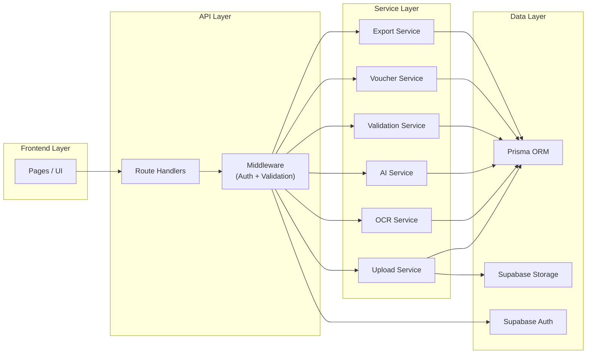
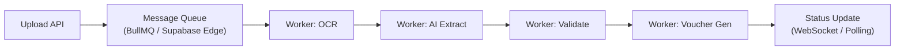

# API and Module Specification

**Document Version:** 1.1  
**Last Updated:** August 2026

---

## 1. Module Architecture



---

## 2. Module Specifications

### Auth Module

| Responsibility | Description |
|---------------|-------------|
| Authentication | Signup, login, logout, password reset via Supabase Auth |
| Session handling | JWT token management, refresh tokens, cookie-based sessions |
| Role checks | Middleware to verify `ADMIN`, `OPERATOR`, or `VIEWER` role |
| Firm scoping | Attach `firm_id` to all authenticated requests |

### Company Module

| Responsibility | Description |
|---------------|-------------|
| Firm profile | CRUD operations for the firm entity |
| Company settings | Firm preferences, default configurations |
| Client records | CRUD operations for clients within a firm |

### Invoice Module

| Responsibility | Description |
|---------------|-------------|
| Upload | Accept files, validate, store, create invoice records |
| Listing | Paginated, filterable, sortable invoice list |
| Detail view | Single invoice with all related data |
| Status tracking | Track and update invoice status through lifecycle |
| Processing pipeline | Orchestrate OCR → AI → Validation → Voucher flow |

### OCR Module

| Responsibility | Description |
|---------------|-------------|
| File preprocessing | Image optimization with Sharp |
| OCR execution | Tesseract.js for scans, pdf-parse for text PDFs |
| Result storage | Save raw OCR text for traceability |

### AI Module

| Responsibility | Description |
|---------------|-------------|
| Prompt construction | Build context-aware prompts from OCR text |
| Extraction request | Call Groq API, handle timeouts and errors |
| Ledger suggestion | Classify line items into accounting ledgers |
| Confidence scoring | Calculate per-field and overall confidence |
| Response validation | Parse and validate AI output with Zod |

### Validation Module

| Responsibility | Description |
|---------------|-------------|
| Rules engine | Run all validation rules against extracted data |
| Duplicate detection | Check for matching invoices in the database |
| Tax and total checks | Verify arithmetic consistency |
| Result aggregation | Compile pass/fail/warning results |

### Voucher Module

| Responsibility | Description |
|---------------|-------------|
| Voucher creation | Generate voucher from validated invoice data |
| Accounting line generation | Map items to debit/credit entries with ledgers |
| Review payload generation | Prepare data for the review screen |

### Export Module

| Responsibility | Description |
|---------------|-------------|
| XML generation | Build Tally Prime-compatible XML |
| Export logging | Record export attempts with status |
| Retry handling | Re-attempt failed exports |

---

## 3. Standard API Response Format

### Success Response

```typescript
interface ApiSuccessResponse<T> {
  success: true;
  data: T;
  meta?: {
    page?: number;
    pageSize?: number;
    totalCount?: number;
    totalPages?: number;
  };
}
```

### Error Response

```typescript
interface ApiErrorResponse {
  success: false;
  error: {
    code: string;          // Machine-readable error code
    message: string;       // Human-readable error message
    details?: unknown;     // Additional error context
  };
}
```

### Standard Error Codes

| Code | HTTP Status | Description |
|------|------------|-------------|
| `AUTH_REQUIRED` | 401 | No valid authentication token |
| `AUTH_EXPIRED` | 401 | Token has expired |
| `FORBIDDEN` | 403 | User lacks required role/permission |
| `NOT_FOUND` | 404 | Requested resource does not exist |
| `VALIDATION_ERROR` | 400 | Request body validation failed |
| `DUPLICATE_ENTRY` | 409 | Resource already exists (e.g., duplicate invoice) |
| `FILE_TOO_LARGE` | 413 | Uploaded file exceeds size limit |
| `UNSUPPORTED_FILE` | 415 | Unsupported file type |
| `PROCESSING_FAILED` | 500 | OCR or AI processing error |
| `EXPORT_FAILED` | 500 | XML generation error |
| `RATE_LIMITED` | 429 | Too many requests |
| `INTERNAL_ERROR` | 500 | Unexpected server error |

---

## 4. API Routes — Full Specification

### 4.1 Authentication

#### `POST /api/auth/signup`

Create a new user account.

| Field | Details |
|-------|---------|
| **Auth** | Public |
| **Rate Limit** | 5 per minute per IP |

```typescript
// Request
interface SignupRequest {
  email: string;           // Valid email address
  password: string;        // Min 8 chars, 1 uppercase, 1 number
  firmName: string;        // Firm name (creates new firm)
  firmGstin?: string;      // Optional GSTIN for the firm
}

// Response (201 Created)
interface SignupResponse {
  success: true;
  data: {
    user: {
      id: string;
      email: string;
      role: 'ADMIN';
    };
    firm: {
      id: string;
      name: string;
    };
  };
}
```

#### `POST /api/auth/login`

Authenticate and receive session.

| Field | Details |
|-------|---------|
| **Auth** | Public |
| **Rate Limit** | 10 per minute per IP |

```typescript
// Request
interface LoginRequest {
  email: string;
  password: string;
}

// Response (200 OK)
interface LoginResponse {
  success: true;
  data: {
    user: {
      id: string;
      email: string;
      role: UserRole;
      firmId: string;
    };
    session: {
      accessToken: string;
      refreshToken: string;
      expiresAt: string;   // ISO 8601
    };
  };
}
```

#### `POST /api/auth/forgot-password`

Send password reset email.

| Field | Details |
|-------|---------|
| **Auth** | Public |
| **Rate Limit** | 3 per minute per email |

```typescript
// Request
interface ForgotPasswordRequest {
  email: string;
}

// Response (200 OK — always returns success to prevent email enumeration)
interface ForgotPasswordResponse {
  success: true;
  data: {
    message: 'If an account exists, a reset email has been sent.';
  };
}
```

#### `POST /api/auth/logout`

End the current session.

| Field | Details |
|-------|---------|
| **Auth** | Required (any role) |

```typescript
// Response (200 OK)
interface LogoutResponse {
  success: true;
  data: {
    message: 'Logged out successfully';
  };
}
```

---

### 4.2 Companies and Clients

#### `GET /api/companies`

Get the authenticated user's firm details.

| Field | Details |
|-------|---------|
| **Auth** | Required (any role) |

```typescript
// Response (200 OK)
interface GetCompanyResponse {
  success: true;
  data: {
    id: string;
    name: string;
    gstin: string | null;
    address: string | null;
    phone: string | null;
    email: string | null;
    createdAt: string;
  };
}
```

#### `POST /api/companies`

Update firm details.

| Field | Details |
|-------|---------|
| **Auth** | Required (ADMIN only) |

```typescript
// Request
interface UpdateCompanyRequest {
  name?: string;
  gstin?: string;
  address?: string;
  phone?: string;
  email?: string;
}

// Response (200 OK)
// Same as GetCompanyResponse with updated fields
```

#### `GET /api/clients`

List all clients for the firm.

| Field | Details |
|-------|---------|
| **Auth** | Required (ADMIN, OPERATOR) |
| **Pagination** | `?page=1&pageSize=20` |
| **Search** | `?search=abc` (searches name, company_name, gstin) |

```typescript
// Response (200 OK)
interface GetClientsResponse {
  success: true;
  data: Client[];
  meta: {
    page: number;
    pageSize: number;
    totalCount: number;
    totalPages: number;
  };
}

interface Client {
  id: string;
  name: string;
  companyName: string | null;
  gstin: string | null;
  contactPerson: string | null;
  phone: string | null;
  email: string | null;
  createdAt: string;
}
```

#### `POST /api/clients`

Create a new client.

| Field | Details |
|-------|---------|
| **Auth** | Required (ADMIN, OPERATOR) |

```typescript
// Request
interface CreateClientRequest {
  name: string;              // Required
  companyName?: string;
  gstin?: string;
  contactPerson?: string;
  phone?: string;
  email?: string;
}

// Response (201 Created)
// Returns the created Client object
```

---

### 4.3 Invoices

#### `POST /api/invoices/upload`

Upload an invoice for processing.

| Field | Details |
|-------|---------|
| **Auth** | Required (ADMIN, OPERATOR) |
| **Content-Type** | `multipart/form-data` |
| **Max File Size** | 10 MB |
| **Allowed Types** | `application/pdf`, `image/jpeg`, `image/png` |

```typescript
// Request: FormData with file + optional metadata
// FormData fields:
//   file: File (required)
//   clientId?: string (optional)

// Response (201 Created)
interface UploadResponse {
  success: true;
  data: {
    invoiceId: string;
    status: 'UPLOADED';
    sourceFileUrl: string;
    message: 'Invoice uploaded successfully. Processing will begin shortly.';
  };
}
```

#### `GET /api/invoices`

List invoices with filtering and pagination.

| Field | Details |
|-------|---------|
| **Auth** | Required (ADMIN, OPERATOR) |
| **Pagination** | `?page=1&pageSize=20` |
| **Filters** | `?status=NEEDS_REVIEW&clientId=xxx&dateFrom=2026-07-01&dateTo=2026-07-31` |
| **Sort** | `?sortBy=createdAt&sortOrder=desc` |
| **Search** | `?search=INV-2045` (searches invoice_number, vendor_name) |

```typescript
// Response (200 OK)
interface GetInvoicesResponse {
  success: true;
  data: InvoiceListItem[];
  meta: {
    page: number;
    pageSize: number;
    totalCount: number;
    totalPages: number;
  };
}

interface InvoiceListItem {
  id: string;
  invoiceNumber: string | null;
  vendorName: string | null;
  invoiceDate: string | null;
  total: number | null;
  status: InvoiceStatus;
  confidenceScore: number | null;
  reviewRequired: boolean;
  isDuplicateSuspect: boolean;
  createdAt: string;
}
```

#### `GET /api/invoices/:id`

Get full invoice details including items, validations, suggestions, and vouchers.

| Field | Details |
|-------|---------|
| **Auth** | Required (ADMIN, OPERATOR) |

```typescript
// Response (200 OK)
interface GetInvoiceDetailResponse {
  success: true;
  data: {
    invoice: {
      id: string;
      invoiceNumber: string | null;
      vendorName: string | null;
      vendorGstin: string | null;
      invoiceDate: string | null;
      documentType: DocumentType | null;
      sourceFileUrl: string;
      ocrText: string | null;
      subtotal: number | null;
      cgst: number | null;
      sgst: number | null;
      igst: number | null;
      total: number | null;
      status: InvoiceStatus;
      confidenceScore: number | null;
      reviewRequired: boolean;
      isDuplicateSuspect: boolean;
      processedAt: string | null;
      approvedAt: string | null;
      createdAt: string;
    };
    items: InvoiceItem[];
    validationResults: ValidationResult[];
    ledgerSuggestions: LedgerSuggestion[];
    vouchers: VoucherSummary[];
  };
}

interface InvoiceItem {
  id: string;
  description: string;
  quantity: number;
  unitRate: number;
  hsnCode: string | null;
  taxRate: number;
  taxAmount: number;
  lineTotal: number;
}

interface ValidationResult {
  id: string;
  ruleName: string;
  status: 'PASS' | 'FAIL' | 'WARNING';
  message: string;
  severity: 'ERROR' | 'WARNING' | 'INFO';
}

interface LedgerSuggestion {
  id: string;
  itemId: string | null;
  suggestedLedger: string;
  confidenceScore: number;
  sourceReason: string | null;
  approvedLedger: string | null;
}

interface VoucherSummary {
  id: string;
  voucherNumber: string;
  voucherType: VoucherType;
  status: VoucherStatus;
  totalAmount: number;
}
```

#### `PATCH /api/invoices/:id`

Update extracted invoice data (during review).

| Field | Details |
|-------|---------|
| **Auth** | Required (ADMIN, OPERATOR) |

```typescript
// Request — all fields optional (partial update)
interface UpdateInvoiceRequest {
  invoiceNumber?: string;
  vendorName?: string;
  vendorGstin?: string;
  invoiceDate?: string;
  subtotal?: number;
  cgst?: number;
  sgst?: number;
  igst?: number;
  total?: number;
  items?: {
    id?: string;             // Existing item ID (for update)
    description: string;
    quantity: number;
    unitRate: number;
    hsnCode?: string;
    taxRate: number;
    taxAmount: number;
    lineTotal: number;
  }[];
}

// Response (200 OK) — returns updated invoice detail
```

#### `POST /api/invoices/:id/reprocess`

Re-trigger the processing pipeline for a failed or incorrect invoice.

| Field | Details |
|-------|---------|
| **Auth** | Required (ADMIN, OPERATOR) |
| **Preconditions** | Status must be `FAILED`, `NEEDS_REVIEW`, or `REJECTED` |

```typescript
// Response (200 OK)
interface ReprocessResponse {
  success: true;
  data: {
    invoiceId: string;
    status: 'PROCESSING';
    message: 'Reprocessing initiated';
  };
}
```

---

### 4.4 Review and Approval

#### `POST /api/invoices/:id/approve`

Approve an invoice and finalize its voucher.

| Field | Details |
|-------|---------|
| **Auth** | Required (ADMIN, OPERATOR) |
| **Preconditions** | Status must be `NEEDS_REVIEW` or `EXTRACTED` |

```typescript
// Request (optional — approve with edits)
interface ApproveRequest {
  ledgerOverrides?: {
    itemId: string;
    approvedLedger: string;
  }[];
}

// Response (200 OK)
interface ApproveResponse {
  success: true;
  data: {
    invoiceId: string;
    status: 'APPROVED';
    voucherId: string;
    message: 'Invoice approved successfully';
  };
}
```

#### `POST /api/invoices/:id/reject`

Reject an invoice.

| Field | Details |
|-------|---------|
| **Auth** | Required (ADMIN, OPERATOR) |
| **Preconditions** | Status must be `NEEDS_REVIEW` or `EXTRACTED` |

```typescript
// Request
interface RejectRequest {
  reason: string;           // Required — why it was rejected
}

// Response (200 OK)
interface RejectResponse {
  success: true;
  data: {
    invoiceId: string;
    status: 'REJECTED';
    message: 'Invoice rejected';
  };
}
```

#### `POST /api/invoices/:id/review-save`

Save review edits without approving or rejecting.

| Field | Details |
|-------|---------|
| **Auth** | Required (ADMIN, OPERATOR) |

```typescript
// Request — same as UpdateInvoiceRequest
// Response (200 OK) — returns updated invoice detail
```

---

### 4.5 Export

#### `POST /api/invoices/:id/export-xml`

Generate Tally XML for an approved invoice.

| Field | Details |
|-------|---------|
| **Auth** | Required (ADMIN, OPERATOR) |
| **Preconditions** | Status must be `APPROVED` |

```typescript
// Response (200 OK)
interface ExportXmlResponse {
  success: true;
  data: {
    exportId: string;
    invoiceId: string;
    voucherId: string;
    fileUrl: string;           // Download URL
    exportStatus: 'SUCCESS';
    generatedAt: string;
  };
}
```

#### `GET /api/exports/:id`

Get export details and download URL.

| Field | Details |
|-------|---------|
| **Auth** | Required (ADMIN, OPERATOR) |

```typescript
// Response (200 OK)
interface GetExportResponse {
  success: true;
  data: {
    id: string;
    invoiceId: string;
    voucherId: string;
    fileUrl: string | null;
    exportStatus: ExportStatus;
    errorMessage: string | null;
    attemptNumber: number;
    generatedAt: string;
  };
}
```

---

## 5. Shared TypeScript Types

```typescript
// types/index.ts

// ─────────────────────────────────────
// Enums
// ─────────────────────────────────────

export type UserRole = 'ADMIN' | 'OPERATOR' | 'VIEWER';

export type DocumentType = 'PDF_TEXT' | 'PDF_SCANNED' | 'IMAGE_JPG' | 'IMAGE_PNG';

export type InvoiceStatus =
  | 'UPLOADED'
  | 'PROCESSING'
  | 'EXTRACTED'
  | 'NEEDS_REVIEW'
  | 'APPROVED'
  | 'REJECTED'
  | 'EXPORTED'
  | 'FAILED';

export type VoucherType = 'PURCHASE' | 'SALES' | 'JOURNAL' | 'RECEIPT' | 'PAYMENT';

export type VoucherStatus = 'DRAFT' | 'REVIEWED' | 'APPROVED' | 'EXPORTED' | 'FAILED';

export type ValidationStatus = 'PASS' | 'FAIL' | 'WARNING';

export type ValidationSeverity = 'ERROR' | 'WARNING' | 'INFO';

export type EntryType = 'DEBIT' | 'CREDIT';

export type ExportStatus = 'PENDING' | 'SUCCESS' | 'FAILED';

// ─────────────────────────────────────
// Core Types
// ─────────────────────────────────────

export interface Invoice {
  id: string;
  firmId: string;
  clientId: string | null;
  uploadedById: string;
  invoiceNumber: string | null;
  vendorName: string | null;
  vendorGstin: string | null;
  invoiceDate: string | null;
  documentType: DocumentType | null;
  sourceFileUrl: string;
  ocrText: string | null;
  aiRawResponse: unknown | null;
  subtotal: number | null;
  cgst: number | null;
  sgst: number | null;
  igst: number | null;
  total: number | null;
  currency: string;
  status: InvoiceStatus;
  confidenceScore: number | null;
  reviewRequired: boolean;
  isDuplicateSuspect: boolean;
  processedAt: string | null;
  approvedAt: string | null;
  createdAt: string;
  updatedAt: string;
}

export interface InvoiceItem {
  id: string;
  invoiceId: string;
  description: string;
  quantity: number;
  unitRate: number;
  hsnCode: string | null;
  taxRate: number;
  taxAmount: number;
  lineTotal: number;
  sortOrder: number;
}

export interface ValidationResult {
  id: string;
  invoiceId: string;
  ruleName: string;
  status: ValidationStatus;
  message: string;
  severity: ValidationSeverity;
  details: unknown | null;
  createdAt: string;
}

export interface LedgerSuggestion {
  id: string;
  invoiceId: string;
  itemId: string | null;
  suggestedLedger: string;
  confidenceScore: number;
  sourceReason: string | null;
  approvedLedger: string | null;
  approvedById: string | null;
  createdAt: string;
}

export interface Voucher {
  id: string;
  invoiceId: string;
  voucherNumber: string;
  voucherType: VoucherType;
  voucherDate: string;
  status: VoucherStatus;
  totalAmount: number;
  narration: string | null;
  createdById: string;
  approvedById: string | null;
  approvedAt: string | null;
  createdAt: string;
  updatedAt: string;
}

export interface VoucherLine {
  id: string;
  voucherId: string;
  ledgerName: string;
  entryType: EntryType;
  amount: number;
  taxType: string | null;
  narration: string | null;
  sortOrder: number;
}

export interface XmlExport {
  id: string;
  invoiceId: string;
  voucherId: string;
  fileUrl: string | null;
  exportStatus: ExportStatus;
  errorMessage: string | null;
  attemptNumber: number;
  exportedById: string;
  generatedAt: string;
}

export interface AuditLog {
  id: string;
  actorUserId: string;
  entityType: string;
  entityId: string;
  action: string;
  beforeValue: unknown | null;
  afterValue: unknown | null;
  ipAddress: string | null;
  createdAt: string;
}

// ─────────────────────────────────────
// Processing Types
// ─────────────────────────────────────

export interface ProcessingResult {
  invoiceId: string;
  status: InvoiceStatus;
  extractedData: AIExtractionResult | null;
  validationResults: ValidationResult[];
  ledgerSuggestions: LedgerSuggestion[];
  voucher: Voucher | null;
  error: string | null;
}

export interface AIExtractionResult {
  invoiceNumber: string;
  invoiceDate: string;
  vendorName: string;
  vendorGstin: string | null;
  items: {
    description: string;
    quantity: number;
    rate: number;
    hsnCode: string | null;
    taxRate: number | null;
    taxAmount: number;
    lineTotal: number;
  }[];
  subtotal: number;
  cgst: number;
  sgst: number;
  igst: number;
  total: number;
}

export interface ConfidenceScores {
  overall: number;
  invoiceNumber: number;
  vendorName: number;
  vendorGstin: number;
  items: number;
  totals: number;
}
```

---

## 6. Middleware Specifications

### Authentication Middleware

```typescript
// Runs on all /api/* routes except /api/auth/*
async function authMiddleware(request: NextRequest) {
  // 1. Extract JWT from cookie or Authorization header
  // 2. Verify with Supabase Auth
  // 3. Attach user session to request context
  // 4. If invalid → return 401 AUTH_REQUIRED
  // 5. If expired → return 401 AUTH_EXPIRED
}
```

### Role Authorization Middleware

```typescript
// Runs after auth middleware on role-restricted routes
function requireRole(...roles: UserRole[]) {
  return async function(request: NextRequest) {
    // 1. Get user role from session
    // 2. Check if user role is in allowed roles
    // 3. If not → return 403 FORBIDDEN
  };
}
```

### Firm Scoping Middleware

```typescript
// Ensures all database queries are scoped to the user's firm
async function firmScopeMiddleware(request: NextRequest) {
  // 1. Get firm_id from user session
  // 2. Attach firm_id to request context
  // 3. All subsequent DB queries MUST filter by this firm_id
}
```

### Request Validation Middleware

```typescript
// Validates request body/params against Zod schemas
function validateRequest<T>(schema: ZodSchema<T>) {
  return async function(request: NextRequest) {
    // 1. Parse request body
    // 2. Validate against Zod schema
    // 3. If invalid → return 400 VALIDATION_ERROR with details
    // 4. If valid → attach parsed data to request context
  };
}
```

### Rate Limiting

| Route Pattern | Limit | Window |
|--------------|-------|--------|
| `POST /api/auth/signup` | 5 requests | Per minute per IP |
| `POST /api/auth/login` | 10 requests | Per minute per IP |
| `POST /api/auth/forgot-password` | 3 requests | Per minute per email |
| `POST /api/invoices/upload` | 30 requests | Per minute per user |
| `POST /api/invoices/:id/extract` | 10 requests | Per minute per user |
| All other routes | 100 requests | Per minute per user |

---

## 7. Frontend Screens

| Screen | Route | Auth | Role |
|--------|-------|------|------|
| Login | `/login` | Public | — |
| Signup | `/signup` | Public | — |
| Forgot Password | `/forgot-password` | Public | — |
| Dashboard | `/dashboard` | Required | All |
| Invoice Upload | `/invoices/upload` | Required | Admin, Operator |
| Invoice List | `/invoices` | Required | All |
| Invoice Detail & Review | `/invoices/[id]` | Required | All (edit: Admin, Operator) |
| Export History | `/exports` | Required | All |
| Client List | `/clients` | Required | Admin, Operator |
| Settings | `/settings` | Required | Admin |

---

## 8. Background Processing Notes

Phase 1 uses **synchronous processing** — the API handles OCR, AI, and validation in a single request/response cycle. This is acceptable for MVP because:

- Groq API is fast (~5s response time)
- OCR is local (no external API call)
- Expected volume is low (<100 invoices/day initially)

### Phase 2: Async Processing Architecture

When synchronous processing becomes slow, migrate to:



---

## 9. Observability

### Metrics to Track

| Metric | Type | Alert Threshold |
|--------|------|----------------|
| Upload success rate | Percentage | < 95% |
| OCR success rate | Percentage | < 90% |
| AI extraction success rate | Percentage | < 85% |
| Validation pass rate | Percentage | Informational |
| Export success rate | Percentage | < 95% |
| Average OCR processing time | Duration | > 20s |
| Average AI extraction time | Duration | > 15s |
| Manual correction frequency | Percentage | Informational (learning metric) |
| API response time (P95) | Duration | > 2s |
| Error rate (5xx) | Percentage | > 1% |

### Logging Strategy

| Layer | What to Log | Level |
|-------|------------|-------|
| API routes | Request method, path, status, duration | Info |
| Auth | Login attempts, failures, password resets | Info / Warn |
| Upload | File size, type, storage result | Info |
| OCR | Processing time, character count, confidence | Info |
| AI | Prompt tokens, response tokens, latency, model | Info |
| Validation | Rule results, failure reasons | Info / Warn |
| Export | Generation time, file size, success/failure | Info |
| Errors | Full stack trace, request context | Error |
