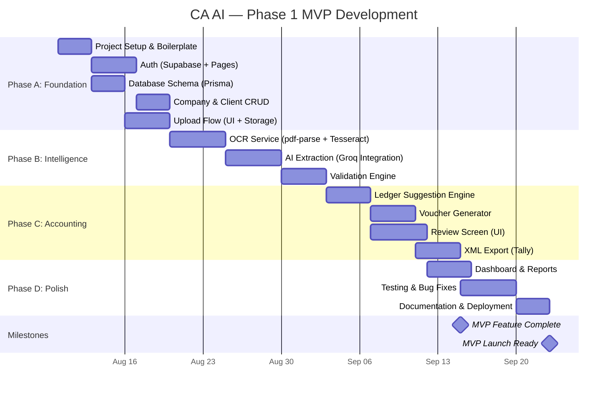
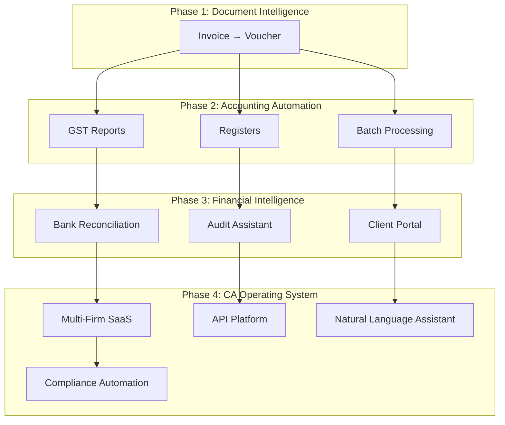

# Development Roadmap

**Document Version:** 1.1  
**Last Updated:** August 2026

---

## 1. MVP Delivery Plan

### Gantt Chart — Phase 1 Timeline

---

## 2. Milestone Details

### Milestone 1: Project Setup (3 days)

| Task | Details | Definition of Done |
|------|---------|-------------------|
| Initialize Next.js 15 project | TypeScript, App Router, `src/` directory | Project runs with `npm run dev` |
| Configure Tailwind CSS + shadcn/ui | Install and configure theme | shadcn Button renders correctly |
| Set up Supabase project | Create project, get API keys | Connection test passes |
| Configure Prisma | Set up schema, connect to Supabase DB | `prisma generate` succeeds |
| Create base layout | Header, sidebar, footer, route groups | All pages render in layout shell |
| Set up environment variables | Create `.env.example` with all vars | All vars documented |

**Estimated Effort:** 3 developer-days

---

### Milestone 2: Authentication (4 days)

| Task | Details | Definition of Done |
|------|---------|-------------------|
| Signup page | Email + password form, firm creation | New user can sign up, firm created |
| Login page | Email + password, error handling | User can log in, session persisted |
| Forgot password page | Email input, reset flow | Reset email sent and works |
| Auth middleware | Protect dashboard routes | Unauthenticated users redirected to login |
| Session management | Cookie-based, auto-refresh | Session persists across page reloads |
| Role-based access | Admin vs Operator permissions | Role checks work on protected routes |

**Estimated Effort:** 4 developer-days

---

### Milestone 3: Company & Client Management (3 days)

| Task | Details | Definition of Done |
|------|---------|-------------------|
| Firm profile page | View and edit firm details | Admin can update firm info |
| Client list page | Paginated, searchable table | Clients display with pagination |
| Create client form | Name, GSTIN, contact details | New clients saved to database |
| Edit client | Inline editing or modal | Client updates persist |

**Estimated Effort:** 3 developer-days

---

### Milestone 4: Invoice Upload (4 days)

| Task | Details | Definition of Done |
|------|---------|-------------------|
| Upload UI | Drag-and-drop zone + file browser | Files can be selected and dropped |
| File validation | Type check, size check | Invalid files rejected with error message |
| Supabase Storage upload | Store file, get URL | File accessible via URL |
| Create invoice record | Save metadata to database | Invoice appears in list with `UPLOADED` status |
| Upload progress | Progress bar + status toasts | User sees upload progress |

**Estimated Effort:** 4 developer-days

---

### Milestone 5: OCR Service (5 days)

| Task | Details | Definition of Done |
|------|---------|-------------------|
| Document type detection | Text PDF vs scanned/image | Correct type detected for test files |
| pdf-parse integration | Extract text from text PDFs | Full text extracted from test PDF |
| Sharp preprocessing | Grayscale, denoise, sharpen | Processed image improves OCR accuracy |
| Tesseract.js integration | Extract text from images | Text extracted from test scanned invoice |
| OCR output storage | Save raw text to invoice record | OCR text viewable in invoice detail |
| Error handling | Retry logic, failure status | Failed OCR retries 3x, then marks FAILED |

**Estimated Effort:** 5 developer-days

---

### Milestone 6: AI Extraction (5 days)

| Task | Details | Definition of Done |
|------|---------|-------------------|
| Groq API client | Configure API key, model selection | API call returns response |
| Extraction prompt | Build from template + OCR text | Prompt produces structured JSON |
| Response parsing | Parse JSON, handle malformed output | Valid JSON extracted from response |
| Zod validation | Validate AI output against schema | Schema rejects invalid data |
| Confidence scoring | Calculate per-field confidence | Confidence scores stored per invoice |
| Retry logic | Fallback prompt on failure | Retries with simplified prompt |
| Store results | Save extracted data + AI response | Data visible in invoice detail |

**Estimated Effort:** 5 developer-days

---

### Milestone 7: Validation Engine (4 days)

| Task | Details | Definition of Done |
|------|---------|-------------------|
| GSTIN validation | Format + checksum checks | Invalid GSTINs flagged |
| Arithmetic validation | Items → subtotal → total checks | Mismatches detected |
| Duplicate detection | Query-based duplicate check | Duplicates flagged with `is_duplicate_suspect` |
| Mandatory field checks | Required field presence | Missing fields flagged |
| Date validation | Parseable, not future, not stale | Invalid dates flagged |
| Tax consistency | CGST/SGST vs IGST logic check | Inconsistent tax splits flagged |
| Results storage | Save all validation results | Results viewable in review screen |

**Estimated Effort:** 4 developer-days

---

### Milestone 8: Ledger Suggestion (4 days)

| Task | Details | Definition of Done |
|------|---------|-------------------|
| Keyword mapping rules | Define initial rule set | Common items map to correct ledgers |
| AI-based suggestion | Groq API fallback for unknown items | AI suggests ledger with confidence |
| Suggestion storage | Save suggestions with confidence | Suggestions viewable in review |
| Override capability | User can change suggested ledger | Overrides saved and tracked |

**Estimated Effort:** 4 developer-days

---

### Milestone 9: Voucher Generation (4 days)

| Task | Details | Definition of Done |
|------|---------|-------------------|
| Purchase voucher generator | Map invoice to debit/credit lines | Balanced voucher created for purchase invoice |
| Sales voucher generator | Map sales invoice to voucher | Balanced voucher created for sales invoice |
| Tax ledger mapping | CGST/SGST/IGST ledger lines | Tax entries correct for intra/inter-state |
| Narration generation | Auto-build narration text | Meaningful narration on each voucher |
| Voucher number sequencing | Auto-increment per firm | Unique voucher numbers generated |

**Estimated Effort:** 4 developer-days

---

### Milestone 10: Review Screen (5 days)

| Task | Details | Definition of Done |
|------|---------|-------------------|
| Side-by-side layout | Document viewer + data form | Both panels visible and scrollable |
| Document viewer | PDF/image rendering | Original document displays correctly |
| Editable fields | Inline editing for all extracted data | Edits save and persist |
| Validation display | Show warnings/errors with severity | Validation results visible with icons |
| Voucher preview | Show accounting entries | Voucher lines display correctly |
| Approve action | Approve button + confirmation | Invoice status → APPROVED |
| Reject action | Reject button + reason modal | Invoice status → REJECTED |
| Reprocess action | Reprocess button | Pipeline re-triggered |
| Keyboard shortcuts | Ctrl+Enter, etc. | Shortcuts work as documented |

**Estimated Effort:** 5 developer-days

---

### Milestone 11: XML Export (4 days)

| Task | Details | Definition of Done |
|------|---------|-------------------|
| Tally XML template | Build XML structure from voucher data | Valid XML generated |
| Export API | Generate and store XML file | File stored in Supabase Storage |
| Download flow | User downloads XML | File downloads in browser |
| Export logging | Track attempts and status | Export history viewable |
| Error handling | Graceful failure + retry | Failed exports can be retried |

**Estimated Effort:** 4 developer-days

---

### Milestone 12: Dashboard & Polish (4 days)

| Task | Details | Definition of Done |
|------|---------|-------------------|
| Dashboard widgets | Status counts, throughput chart | Dashboard loads with real data |
| Invoice list filters | Status, date, search | Filters work correctly |
| Toast notifications | Success/error/info toasts | All actions show appropriate toasts |
| Loading states | Skeletons and spinners | No blank states during loading |

**Estimated Effort:** 4 developer-days

---

### Milestone 13: Testing & Deployment (8 days)

| Task | Details | Definition of Done |
|------|---------|-------------------|
| Unit tests | Services, utils, validation rules | >80% coverage on business logic |
| Integration tests | API routes with database | All routes tested |
| E2E test (critical path) | Upload → Review → Export flow | Full workflow completes |
| Bug fixes | Fix issues found in testing | All critical/major bugs resolved |
| Vercel deployment | Configure production deployment | App accessible at production URL |
| Production env setup | Supabase production project | Production database ready |
| Documentation update | Ensure docs match implementation | All docs current |

**Estimated Effort:** 8 developer-days

---

## 3. Effort Summary

| Phase | Milestones | Developer-Days |
|-------|-----------|---------------|
| **Phase A: Foundation** | Setup, Auth, Company, Upload | 14 days |
| **Phase B: Intelligence** | OCR, AI, Validation | 14 days |
| **Phase C: Accounting** | Ledger, Voucher, Review, Export | 17 days |
| **Phase D: Polish** | Dashboard, Testing, Deployment | 12 days |
| **Total** | **13 milestones** | **~57 developer-days** |

> **With 1 full-time developer:** ~12 weeks (3 months)  
> **With 2 developers:** ~7 weeks (~2 months)  
> **With 3 developers:** ~5 weeks (~1.5 months)

---

## 4. Risk Register

| Risk | Probability | Impact | Mitigation |
|------|------------|--------|-----------|
| **OCR accuracy on poor-quality scans** | High | High | Image preprocessing, fallback to manual entry, allow re-upload |
| **AI extraction hallucinations** | Medium | High | Zod schema validation, confidence scoring, mandatory human review |
| **Tally XML format incompatibility** | Medium | High | Test with real Tally Prime early, maintain format reference doc |
| **Groq API downtime/rate limits** | Low | High | Implement retry with exponential backoff, queue system, rate limit handling |
| **Supabase free tier limits** | Medium | Medium | Monitor usage, plan upgrade path, budget for Pro plan ($25/mo) |
| **Multi-page invoice handling** | Medium | Medium | Concatenate page text, test with multi-page samples early |
| **GSTIN validation edge cases** | Low | Medium | Use comprehensive regex + checksum, allow manual override |
| **Scope creep (Phase 2 features)** | High | Medium | Strict MoSCoW adherence, defer non-Must items |
| **Performance under load** | Low | Medium | Profile early, add indexes, consider async processing |
| **Security vulnerabilities** | Low | Critical | RLS policies, input validation, OWASP checklist review |

---

## 5. Testing Strategy

### Unit Tests

| Target | Tool | Coverage Target |
|--------|------|----------------|
| Validation rules | Vitest | 100% — all rules tested with pass/fail inputs |
| GSTIN validator | Vitest | 100% — valid/invalid format and checksum |
| Date parser | Vitest | 100% — edge cases (future, stale, invalid) |
| Arithmetic checker | Vitest | 100% — tolerance boundaries |
| XML builder | Vitest | 100% — output matches Tally spec |
| Zod schemas | Vitest | 100% — valid/invalid AI responses |

### Integration Tests

| Target | Tool | Scope |
|--------|------|-------|
| Auth API routes | Vitest + supertest | Signup, login, logout, password reset |
| Invoice API routes | Vitest + supertest | Upload, list, detail, update, approve, reject |
| Client API routes | Vitest + supertest | CRUD operations |
| Export API routes | Vitest + supertest | XML generation and download |
| Database operations | Vitest + Prisma test utils | CRUD with real PostgreSQL (test DB) |

### End-to-End Tests

| Flow | Tool | Scope |
|------|------|-------|
| Complete invoice pipeline | Playwright | Upload PDF → OCR → AI → Validate → Review → Approve → Export |
| Authentication flow | Playwright | Signup → Login → Access dashboard → Logout |
| Error recovery | Playwright | Upload bad file → See error → Re-upload → Success |

### Manual Testing Checklist

- [ ] Upload 10 different real invoices and verify extraction accuracy
- [ ] Test with blurry, rotated, and multi-page scans
- [ ] Import generated XML into Tally Prime and verify voucher
- [ ] Test all keyboard shortcuts on review screen
- [ ] Test on Chrome, Firefox, and Edge
- [ ] Test responsive layout on tablet (iPad) and mobile
- [ ] Test with slow network (DevTools throttling)
- [ ] Security: attempt to access another firm's data

---

## 6. Team Structure Recommendations

### Minimum Viable Team (1 person)

| Role | Person | Focus |
|------|--------|-------|
| Full-Stack Developer | Dev 1 | Everything — frontend, backend, AI integration, testing |

**Timeline:** ~12 weeks

### Recommended Team (2–3 people)

| Role | Person | Focus |
|------|--------|-------|
| Frontend Developer | Dev 1 | UI, components, review screen, dashboard |
| Backend Developer | Dev 2 | API routes, services, OCR, AI, database |
| Full-Stack / QA | Dev 3 | Integration, testing, XML export, polish |

**Timeline:** ~5–7 weeks

---

## 7. Phase 2 & Beyond

### Phase 2: Growth Features (estimated 4–6 weeks)

- Batch upload / multi-invoice processing
- Journal, receipt, and payment vouchers
- GST reports (GSTR-1, GSTR-3B summaries)
- Purchase and sales register
- Vendor pattern learning (from user corrections)
- Custom ledger mapping rules
- Export history and re-export

### Phase 3: Scale & Intelligence (estimated 6–8 weeks)

- Async processing with job queues
- Bank reconciliation
- AI audit assistant
- Client portal (self-service upload)
- Advanced reporting and analytics
- Notification system (email + in-app)
- Multi-language invoice support

### Phase 4: Platform (estimated 8–12 weeks)

- Multi-firm SaaS (firm onboarding, billing)
- API for third-party integrations
- Mobile app (React Native)
- Natural language query assistant
- Compliance workflow automation
- White-label option for enterprise CA firms

---

## 8. Long-Term Vision

CA AI should evolve from a document-processing tool into a **comprehensive operating system for CA firms**.

The same structured accounting data generated from invoices can power every downstream use case — from GST filing to audit preparation to management dashboards.

**The philosophy remains:**

> **Upload Once → AI Understands → Human Reviews → System Completes the Rest**
