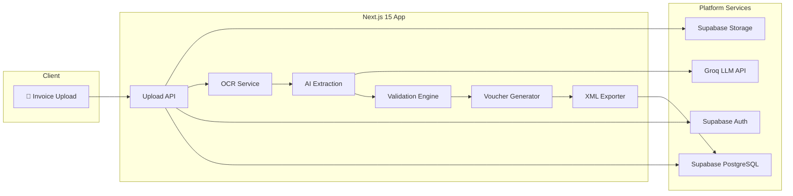

# 🧾 CA AI — AI-Powered Accounting Automation


> **Upload Once → AI Understands → Human Reviews → System Completes the Rest**

CA AI is an AI-first accounting workflow platform for Chartered Accountant firms. It converts invoices into structured accounting data and Tally-ready vouchers — eliminating repetitive data entry so accountants can focus on review, validation, and advisory.

---

## Architecture at a Glance



---

## Quick Start

### Prerequisites

- Node.js 18+ and npm 9+
- Supabase account ([supabase.com](https://supabase.com))
- Groq API key ([console.groq.com](https://console.groq.com))
- Git

### Setup

```bash
# 1. Clone the repository
git clone https://github.com/your-org/ca-ai.git
cd ca-ai

# 2. Install dependencies
npm install

# 3. Copy environment template and fill in your keys
cp .env.example .env.local

# 4. Run database migrations
npx prisma migrate dev

# 5. Seed initial data (optional)
npx prisma db seed

# 6. Start the development server
npm run dev
```

The app will be available at `http://localhost:3000`.

> See [09-environment-and-setup.md](./09-environment-and-setup.md) for a detailed setup guide with troubleshooting.

---

## Documentation Index

| # | Document | Description |
|---|----------|-------------|
| 01 | [Product Requirements](./01-product-requirements.md) | Vision, user personas, user stories, functional & non-functional requirements, MoSCoW prioritization |
| 02 | [System Architecture](./02-system-architecture.md) | Tech stack rationale, component & sequence diagrams, environment variables, performance targets |
| 03 | [Database Design](./03-database-design.md) | ER diagram, field specifications, Prisma schema, indexes, migration strategy |
| 04 | [Features & Workflows](./04-features-and-workflows.md) | Feature breakdown, state machines, wireframe descriptions, edge cases, notifications |
| 05 | [AI, OCR & Voucher Spec](./05-ai-ocr-voucher-spec.md) | OCR pipeline, AI prompt engineering, validation rules, Zod schemas, GST logic, cost model |
| 06 | [API & Module Spec](./06-api-and-module-spec.md) | API routes with request/response contracts, TypeScript types, error codes, middleware |
| 07 | [Development Roadmap](./07-development-roadmap.md) | Milestones with time estimates, Gantt chart, risk register, testing strategy |
| 08 | [Tally XML Specification](./08-tally-xml-specification.md) | Complete Tally Prime XML structure, field mappings, voucher examples, import guide |
| 09 | [Environment & Setup](./09-environment-and-setup.md) | Prerequisites, env vars, local setup, Supabase config, Prisma workflows |
| 10 | [Glossary](./10-glossary.md) | Accounting, GST, technical, and product-specific term definitions |

---

## Tech Stack

| Layer | Technology | Purpose |
|-------|-----------|---------|
| **Frontend** | Next.js 15, TypeScript, Tailwind CSS, shadcn/ui | UI framework & components |
| **State** | Zustand, React Hook Form | Client state & form management |
| **Data Display** | TanStack Table, Recharts | Tables & charts |
| **Backend** | Next.js Route Handlers, Server Actions | API layer |
| **ORM** | Prisma | Database access & migrations |
| **Database** | Supabase PostgreSQL | Relational data storage |
| **Auth** | Supabase Auth | Authentication & session management |
| **Storage** | Supabase Storage | File storage for invoices |
| **OCR** | pdf-parse, Tesseract.js, Sharp | Document text extraction |
| **AI** | Groq API (LLaMA 3.3 70B) | Intelligent data extraction |
| **Deployment** | Vercel | Hosting & CI/CD |
| **UI Polish** | Sonner, Lucide | Toasts & icons |

---

## Core Workflow

```
┌─────────────┐    ┌──────────┐    ┌────────────┐    ┌────────────┐    ┌──────────┐
│   Upload     │───▶│   OCR    │───▶│ AI Extract │───▶│  Validate  │───▶│  Suggest  │
│   Invoice    │    │  Parse   │    │  Fields    │    │  GST/Math  │    │  Ledgers  │
└─────────────┘    └──────────┘    └────────────┘    └────────────┘    └──────────┘
                                                                            │
┌─────────────┐    ┌──────────┐    ┌────────────┐                          │
│  Import to   │◀──│  Export   │◀──│  Human     │◀─────────────────────────┘
│  Tally       │    │  XML     │    │  Review    │
└─────────────┘    └──────────┘    └────────────┘
```

---

## Contributing

1. Create a feature branch from `main`
2. Follow the existing code style and TypeScript strict mode
3. Write tests for new features
4. Update relevant documentation
5. Submit a pull request with a clear description

### Commit Convention

```
feat: add invoice duplicate detection
fix: correct GST calculation for inter-state
docs: update API route documentation
chore: upgrade dependencies
```

---

## Project Status

CA AI is currently in **active development** (Phase 1 — MVP).

See the [Development Roadmap](./07-development-roadmap.md) for milestone details and progress.

---

## License

This project is **proprietary**. All rights reserved.

---

## Contact

For questions, feedback, or collaboration inquiries, reach out to the development team.
